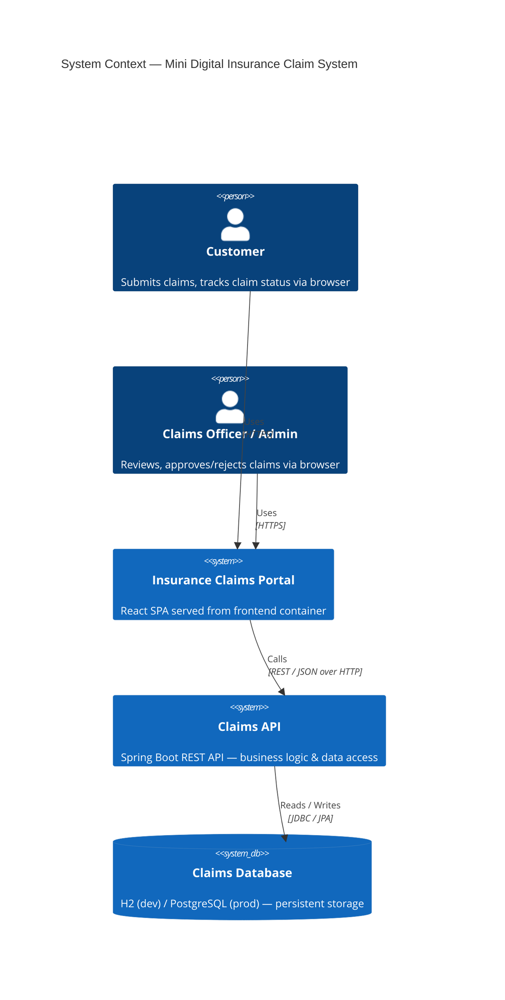
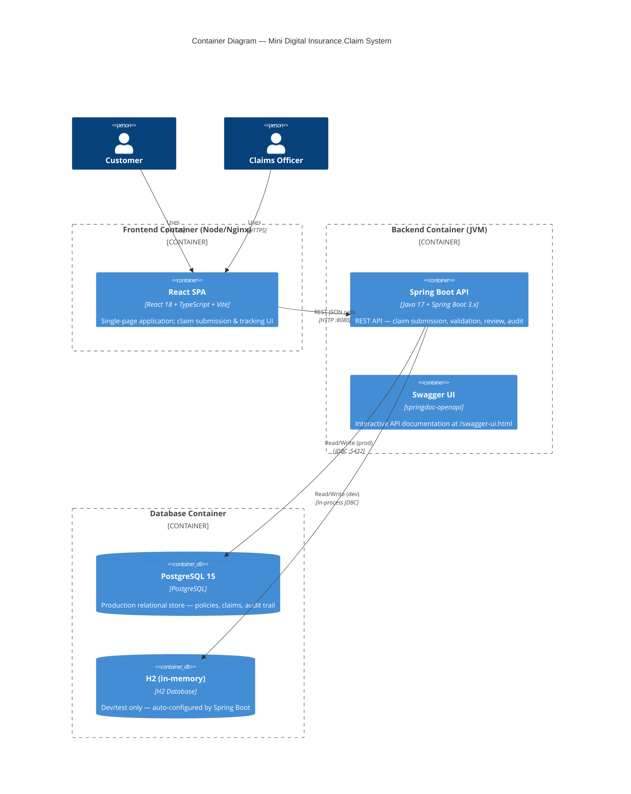
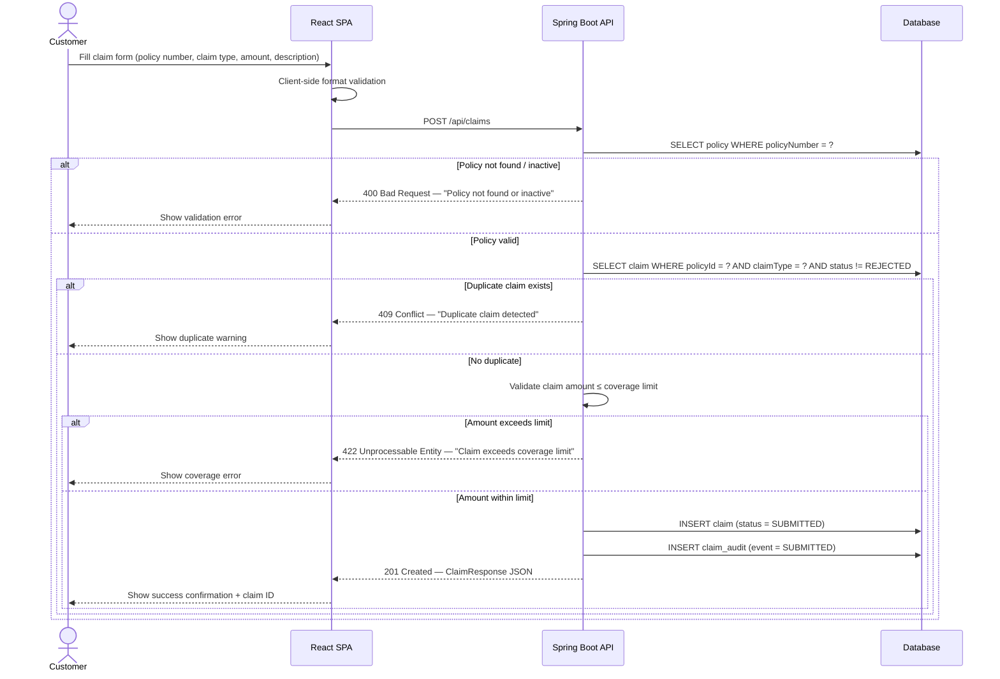
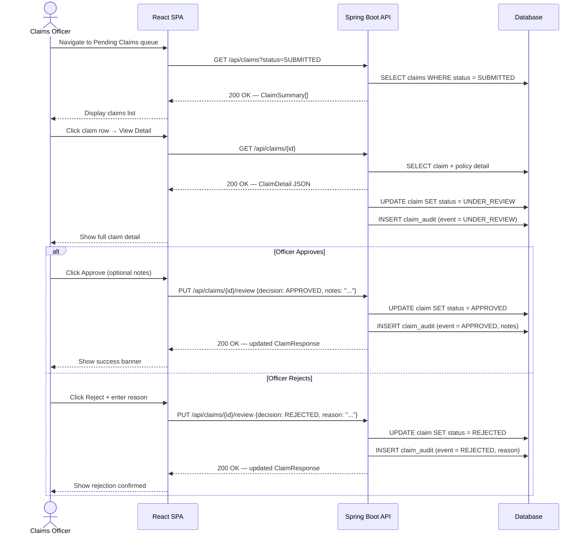

# High-Level Design (HLD)
## Mini Digital Insurance Claim System

---

| Field | Value |
|---|---|
| **Project** | Mini Digital Insurance Claim System |
| **Document Type** | High-Level Design |
| **Author** | Architect Agent |
| **Status** | Approved |

### Document History

| Version | Date | Author | Summary |
|---|---|---|---|
| v1.0 | 2026-03-11 | Architect Agent | Initial HLD — Spring Boot monolith + React SPA + PostgreSQL |

---

## Table of Contents

1. [Introduction & Objectives](#1-introduction--objectives)
2. [Scope](#2-scope)
3. [System Services & Boundaries](#3-system-services--boundaries)
4. [Architecture Overview](#4-architecture-overview)
5. [Actor Definitions](#5-actor-definitions)
6. [Business Flows](#6-business-flows)
7. [Data Architecture](#7-data-architecture)
8. [Technology Stack](#8-technology-stack)
9. [Non-Functional Requirements](#9-non-functional-requirements)
10. [Security Architecture](#10-security-architecture)
11. [Deployment Model](#11-deployment-model)
12. [Assumptions & Constraints](#12-assumptions--constraints)
13. [Architecture Decision Records (ADRs)](#13-architecture-decision-records-adrs)

---

## 1. Introduction & Objectives

### 1.1 Purpose

This document describes the High-Level Design (HLD) of the **Mini Digital Insurance Claim System** — a web-based platform enabling customers to submit insurance claims online and claims officers to review, approve, or reject those claims through a managed workflow.

### 1.2 Objectives

| # | Objective |
|---|---|
| O-1 | Provide a self-service portal for customers to submit and track insurance claims |
| O-2 | Automate policy existence, coverage, claim type, and duplicate-prevention validations at submission time |
| O-3 | Give claims officers a structured review queue with approve/reject capability |
| O-4 | Maintain a full, immutable audit trail of every claim status transition |
| O-5 | Deliver the system end-to-end within a 3-hour hackathon build window |
| O-6 | Produce a containerised, reproducible deployment via Docker Compose |
| O-7 | Achieve ≥ 80 % unit-test coverage with JUnit 5 |

### 1.3 Background

This system is built as a hackathon dry-run to demonstrate a complete SDLC cycle — requirements, architecture, design, implementation, testing, and DevOps — within a compressed timeline. The architecture deliberately minimises ceremony to achieve a working, demonstrable product.

---

## 2. Scope

### 2.1 In Scope

| Epic | Coverage |
|---|---|
| EPIC 2 — Claim Submission | Submit new claim (US-01), view claim history (US-02) |
| EPIC 3 — Policy & Coverage Validation | Policy check (US-03), claim type (US-04), coverage limit (US-05), duplicate prevention (US-06) |
| EPIC 4 — Claim Review & Management | View pending claims (US-07), review detail (US-08), approve (US-09), reject (US-10) |
| EPIC 5 — Status Tracking | View status (US-11), audit trail (US-12), under-review indicator (US-13) |
| EPIC 6 — NFRs | Exception handling (US-14), logging / OpenAPI / Docker (US-15) |

### 2.2 Out of Scope (Hackathon Constraints)

- **Authentication & authorisation** — No login, no JWT, no session management. Roles are distinguished by URL path prefix or `X-Role` request header for hackathon purposes only.
- **Document / file uploads** — Claimants cannot attach supporting documents.
- **Email / SMS notifications** — No outbound messaging.
- **Payment processing** — Claim approval does not trigger financial settlement.
- **Multi-tenancy** — Single-tenant system; no organisation hierarchy.
- **EPIC 1 (Auth)** — Removed from scope per stakeholder decision on 2026-03-11.

---

## 3. System Services & Boundaries

The system is a **single deployable monolith** exposing a RESTful JSON API. All business logic lives within one Spring Boot application. There are no microservices for the hackathon scope.

### 3.1 Logical Boundaries

| Boundary | Responsibility |
|---|---|
| **Presentation Layer** | React SPA — UI rendering, form validation, API calls via Axios/Fetch |
| **API Layer** | Spring Boot REST controllers — HTTP routing, request/response mapping, OpenAPI docs |
| **Application / Service Layer** | Spring `@Service` beans — business rules, orchestration, validation |
| **Domain / Repository Layer** | Spring Data JPA repositories — data access, query logic |
| **Persistence Layer** | H2 (dev/test) / PostgreSQL (production) — durable storage |
| **Cross-Cutting** | SLF4J/Logback structured logging, `@ControllerAdvice` exception handling |

### 3.2 External Interfaces

For the hackathon scope, there are **no external system integrations**. Policy data is seeded into the local database at startup.

---

## 4. Architecture Overview

### 4.1 System Context Diagram



### 4.2 Container Diagram



### 4.3 Deployment Diagram

```mermaid
C4Deployment
    title Deployment Diagram — Docker Compose Topology

    Deployment_Node(host, "Docker Host (localhost / CI)", "Linux / Docker Engine") {

        Deployment_Node(fe_container, "frontend", "Docker container — nginx:alpine") {
            Container(spa_inst, "React SPA (built assets)", "Nginx serves /dist on :3000")
        }

        Deployment_Node(be_container, "backend", "Docker container — eclipse-temurin:17-jre") {
            Container(api_inst, "Spring Boot JAR", "Listens on :8080")
        }

        Deployment_Node(db_container, "postgres", "Docker container — postgres:15-alpine") {
            ContainerDb(pg_inst, "PostgreSQL", "Data volume: pgdata — listens on :5432")
        }
    }

    Rel(spa_inst, api_inst, "REST HTTP", ":8080")
    Rel(api_inst, pg_inst, "JDBC", ":5432")
    Rel(fe_container, be_container, "Docker network: claims-net")
    Rel(be_container, db_container, "Docker network: claims-net")
```

---

## 5. Actor Definitions

| Actor | Type | Interaction Channel | Key Responsibilities |
|---|---|---|---|
| **Customer** | Human — end user | React SPA (browser) | Submit insurance claims; view personal claim history; track individual claim status |
| **Claims Officer / Admin** | Human — internal staff | React SPA (browser, `/officer` routes or `X-Role: officer` header) | View all pending claims; review claim detail; approve or reject claims with notes |
| **System (automation)** | Internal | Spring Boot business logic | Execute policy validation, coverage checks, duplicate detection; record audit events automatically on every status change |

---

## 6. Business Flows

### 6.1 Claim Submission Flow



### 6.2 Claim Review Flow



---

## 7. Data Architecture

### 7.1 High-Level Entity Model

Three core entities cover all functional requirements:

| Entity | Purpose | Key Attributes |
|---|---|---|
| **Policy** | Represents an insurance policy against which claims can be made | `id`, `policyNumber` (unique), `holderName`, `claimType` (enum), `coverageLimit`, `status` (ACTIVE/INACTIVE), `startDate`, `endDate` |
| **Claim** | Represents a single insurance claim submission | `id`, `policyId` (FK), `claimType` (enum), `claimAmount`, `description`, `status` (SUBMITTED / UNDER_REVIEW / APPROVED / REJECTED), `submittedAt`, `updatedAt` |
| **ClaimAudit** | Immutable log of every status transition on a claim | `id`, `claimId` (FK), `previousStatus`, `newStatus`, `changedBy` (role string), `notes`, `timestamp` |

### 7.2 Entity Relationships

```
Policy (1) ──────< Claim (1) ──────< ClaimAudit
         one policy    many claims   many audit events
         many claims   one policy    per claim
```

### 7.3 Claim Status State Machine

```
                ┌──────────────────────────────────────────────────┐
                │                                                  │
  [POST /claims] ▼                                                  │
           SUBMITTED ──(officer views detail)──► UNDER_REVIEW       │
                                                       │            │
                                          ┌────────────┼────────────┘
                                          ▼            ▼
                                       APPROVED     REJECTED
```

---

## 8. Technology Stack

| Layer | Technology | Version | Rationale |
|---|---|---|---|
| Frontend framework | React | 18.x | Component model, large ecosystem, TypeScript support |
| Frontend build | Vite | 5.x | Fast HMR, simple config, ideal for hackathon |
| Frontend language | TypeScript | 5.x | Type safety, better DX |
| Backend framework | Spring Boot | 3.x | Auto-configuration, embedded Tomcat, production-proven |
| Backend language | Java | 17 (LTS) | Long-term support, modern language features (records, sealed classes) |
| REST API docs | springdoc-openapi (Swagger) | 2.x | Zero-config OpenAPI 3.1 generation |
| ORM | Spring Data JPA / Hibernate | 6.x | Declarative repositories, reduces boilerplate |
| Dev/test DB | H2 | 2.x | In-memory, zero-setup, auto-schema via Hibernate DDL |
| Production DB | PostgreSQL | 15 | Robust RDBMS, Docker image available, JPA-compatible |
| Build tool | Maven | 3.9+ | Mature, plugin-rich, Spring Initializr default |
| Containerisation | Docker + Docker Compose | v2 | Reproducible environments, single `docker compose up` |
| CI/CD | GitHub Actions | — | Native GitHub integration, free for public repos |
| Testing | JUnit 5 + Mockito | 5.x | Spring Boot Test integration, mock support |
| Logging | SLF4J + Logback | — | Structured JSON logging in production profile |
| Exception handling | Spring `@ControllerAdvice` | — | Centralised, consistent error response format |

---

## 9. Non-Functional Requirements

### 9.1 Performance

| NFR | Target | Notes |
|---|---|---|
| API response time (p95) | < 500 ms | For all endpoints under single-user hackathon load |
| Claim submission latency | < 300 ms | Including all validation DB queries |
| Static asset load time | < 2 s | React SPA served from Nginx with gzip |

### 9.2 Reliability

| NFR | Target |
|---|---|
| Application startup | < 10 s on standard laptop hardware |
| Database availability | Postgres container restart policy: `unless-stopped` |
| Graceful error handling | All unhandled exceptions caught by `@ControllerAdvice`; no stack traces exposed to client |

### 9.3 Observability

| NFR | Implementation |
|---|---|
| Structured logging | Logback JSON appender in `prod` profile; human-readable in `dev` |
| Log levels | `ERROR` for exceptions, `INFO` for state transitions, `DEBUG` for repository calls |
| API documentation | Swagger UI auto-generated at `/swagger-ui.html`; OpenAPI JSON at `/v3/api-docs` |
| Health check | Spring Actuator `/actuator/health` endpoint |

### 9.4 Testability

| NFR | Target |
|---|---|
| Unit test coverage | ≥ 80 % line coverage (JaCoCo enforcement in Maven build) |
| Test isolation | `@SpringBootTest` with H2 for integration tests; `@WebMvcTest` for controller slice tests |
| CI gate | GitHub Actions build fails if coverage < 80 % |

### 9.5 Maintainability

- Consistent package structure: `controller`, `service`, `repository`, `domain`, `dto`, `exception`
- DTOs separate from JPA entities (no leaked persistence annotations to API layer)
- OpenAPI annotations on all controller methods

---

## 10. Security Architecture

> **Hackathon Note:** Authentication and authorisation are explicitly out of scope per stakeholder decision. The following describes the minimal security posture appropriate for the hackathon demo environment only. **This system MUST NOT be deployed to a public internet environment without adding proper authentication.**

### 10.1 Role Identification (Hackathon Approach)

Roles are distinguished without authentication by:
- **URL path prefix:** Customer endpoints at `/api/claims/*`, officer endpoints at `/api/officer/*`
- **Optional header:** `X-Role: customer` or `X-Role: officer` for API testing via Swagger/Postman

No token validation, no session management. Any caller can invoke any endpoint.

### 10.2 Input Validation

- **Bean Validation (JSR-380):** `@NotNull`, `@NotBlank`, `@Positive`, `@Size` annotations on all DTO fields
- **`@Valid` on controller parameters:** Triggers validation before business logic executes
- `MethodArgumentNotValidException` caught globally and returned as structured 400 error

### 10.3 SQL Injection Prevention

- All database access via Spring Data JPA / Hibernate — parameterised queries only
- No native SQL with string concatenation

### 10.4 Error Response Sanitisation

- `@ControllerAdvice` strips internal exception messages from client responses in production
- Consistent error response schema: `{ "timestamp", "status", "error", "message", "path" }`

### 10.5 CORS

- Spring Boot CORS configuration allows `http://localhost:3000` (frontend container) during hackathon
- Configurable via `application.properties` for future environments

---

## 11. Deployment Model

### 11.1 Docker Compose Services

| Service Name | Image / Build | Port Mapping | Purpose |
|---|---|---|---|
| `frontend` | `./frontend` (Dockerfile, nginx:alpine) | `3000:80` | Serve React SPA built assets |
| `backend` | `./backend` (Dockerfile, eclipse-temurin:17-jre) | `8080:8080` | Spring Boot API |
| `postgres` | `postgres:15-alpine` | `5432:5432` | PostgreSQL database |

### 11.2 Compose Network

All services communicate on a shared bridge network `claims-net`. The backend resolves `postgres` as the DB hostname.

### 11.3 Volumes

| Volume | Purpose |
|---|---|
| `pgdata` | PostgreSQL data persistence across container restarts |

### 11.4 Environment Variables

| Variable | Service | Example Value |
|---|---|---|
| `SPRING_DATASOURCE_URL` | backend | `jdbc:postgresql://postgres:5432/claimsdb` |
| `SPRING_DATASOURCE_USERNAME` | backend | `claims_user` |
| `SPRING_DATASOURCE_PASSWORD` | backend | `claims_pass` |
| `POSTGRES_DB` | postgres | `claimsdb` |
| `POSTGRES_USER` | postgres | `claims_user` |
| `POSTGRES_PASSWORD` | postgres | `claims_pass` |
| `VITE_API_BASE_URL` | frontend (build-time) | `http://localhost:8080` |

### 11.5 Startup Command

```bash
docker compose up --build
```

### 11.6 CI/CD Pipeline (GitHub Actions)

```
Push to main / PR
    │
    ├── Job: build-test
    │       mvn verify (includes JaCoCo coverage gate ≥ 80%)
    │
    ├── Job: docker-build
    │       docker compose build
    │
    └── Job: (future) deploy-staging
            docker compose up -d (remote host via SSH)
```

---

## 12. Assumptions & Constraints

### 12.1 Hackathon Constraints

| Constraint | Impact |
|---|---|
| 3-hour total build window | Minimal ceremony; monolith over microservices; no auth |
| No authentication | All API endpoints are open; roles by header/path convention only |
| No file uploads | Claim form text fields only; no attachments |
| Single developer/team | No branch strategy complexity; `main` branch only |
| Demo environment only | H2 acceptable for local demo; Docker Compose sufficient for deployment |

### 12.2 Technical Assumptions

| # | Assumption |
|---|---|
| A-1 | Policy data is pre-seeded into the database via `data.sql` at application startup |
| A-2 | All monetary amounts are stored as `DECIMAL(15,2)` representing the local currency unit |
| A-3 | Claim type enum values are: `HEALTH`, `AUTO`, `PROPERTY`, `LIFE` |
| A-4 | Claim status enum values are: `SUBMITTED`, `UNDER_REVIEW`, `APPROVED`, `REJECTED` |
| A-5 | The frontend runs on port 3000; the backend on port 8080; PostgreSQL on port 5432 |
| A-6 | H2 console is available at `/h2-console` in `dev` profile for debugging |
| A-7 | Spring Boot `ddl-auto=create-drop` used for H2 in dev; `validate` used for PostgreSQL |

---

## 13. Architecture Decision Records (ADRs)

### ADR-001 — Use Spring Boot as the Backend Framework

| Field | Detail |
|---|---|
| **Status** | Accepted |
| **Date** | 2026-03-11 |
| **Deciders** | Stakeholder, Architect Agent |

**Context:** A backend framework must be chosen that enables rapid development, built-in dependency injection, ORM integration, and production-grade observability — all within a 3-hour hackathon window.

**Decision:** Use **Spring Boot 3.x** with Java 17.

**Rationale:**
- Auto-configuration eliminates boilerplate setup for web, JPA, validation, and logging
- Embedded Tomcat allows running as a single JAR — no external web server needed
- Spring Data JPA provides repository abstraction reducing data-access code to interface definitions
- springdoc-openapi generates Swagger UI with zero configuration
- Spring `@ControllerAdvice` gives centralised exception handling out of the box
- Extremely well-documented; team productivity is maximised

**Alternatives Considered:**
- Quarkus — faster startup, but less familiar to most Java teams; less documentation
- Micronaut — compile-time DI, but more setup for hackathon context
- Node.js/Express — faster to scaffold, but type safety and JPA ecosystem not available

**Consequences:** Slightly larger JAR and startup time compared to reactive frameworks. Acceptable for hackathon scope.

---

### ADR-002 — Dual Database Strategy (H2 for Dev/Test, PostgreSQL for Production)

| Field | Detail |
|---|---|
| **Status** | Accepted |
| **Date** | 2026-03-11 |
| **Deciders** | Stakeholder, Architect Agent |

**Context:** The system needs a persistent relational database. Development and CI must be fast with zero external dependencies; production requires a robust, durable store.

**Decision:** Use **H2 in-memory** for `dev` and `test` Spring profiles; use **PostgreSQL 15** for the `prod` profile.

**Rationale:**
- H2 requires no installation; Spring Boot auto-creates the schema via Hibernate DDL — ideal for rapid iteration
- H2 is embedded in the JVM process; integration tests run without a running database container
- PostgreSQL is the industry-standard open-source RDBMS — battle-tested, Docker image widely available
- Spring Data JPA abstracts the dialect difference; switching profiles changes only `application-{profile}.properties`
- JaCoCo coverage tests run entirely on H2 in CI — no Docker-in-Docker complexity

**Alternatives Considered:**
- MySQL — compatible, but PostgreSQL preferred for JSONB support (future) and stricter SQL compliance
- Single H2 for everything — insufficient for production; limited concurrency and persistence guarantees
- Single PostgreSQL for everything — requires Docker or external DB for local dev; slower CI

**Consequences:** Developers must be aware of minor SQL dialect differences (e.g. H2 sequence syntax). Mitigated by using JPA-level abstractions and avoiding native SQL.

---

### ADR-003 — No Authentication for Hackathon Scope

| Field | Detail |
|---|---|
| **Status** | Accepted |
| **Date** | 2026-03-11 |
| **Deciders** | Stakeholder, Architect Agent |

**Context:** Implementing JWT authentication, Spring Security configuration, and user management would consume a significant portion of the 3-hour build window without contributing to the core claim workflow demonstration.

**Decision:** **Omit authentication entirely** for the hackathon. Roles are identified by `X-Role` request header or URL path prefix (`/api/claims` for customer, `/api/officer` for officer).

**Rationale:**
- EPIC 1 (Authentication) was explicitly removed from scope by the stakeholder
- The system is a demo/dry-run — no real user data or sensitive information
- Removing Spring Security simplifies CORS configuration, test setup, and all controller slice tests
- The role-by-header/path convention is sufficient to demonstrate role-based UI separation without security overhead

**Alternatives Considered:**
- Spring Security with hard-coded credentials — adds boilerplate, confusing for demo; still not "real" auth
- API key header — marginal security improvement, adds implementation overhead
- Full JWT — correct long-term approach; descoped for time constraint

**Consequences:**
- **Security risk:** API is completely open. Fully acceptable for a controlled demo environment.
- **Future work:** Phase 1 (EPIC 1) auth stories must be implemented before any production deployment. Spring Security dependency should be added and all endpoints secured with role-based access control.

---

*End of HLD — Mini Digital Insurance Claim System v1.0*
