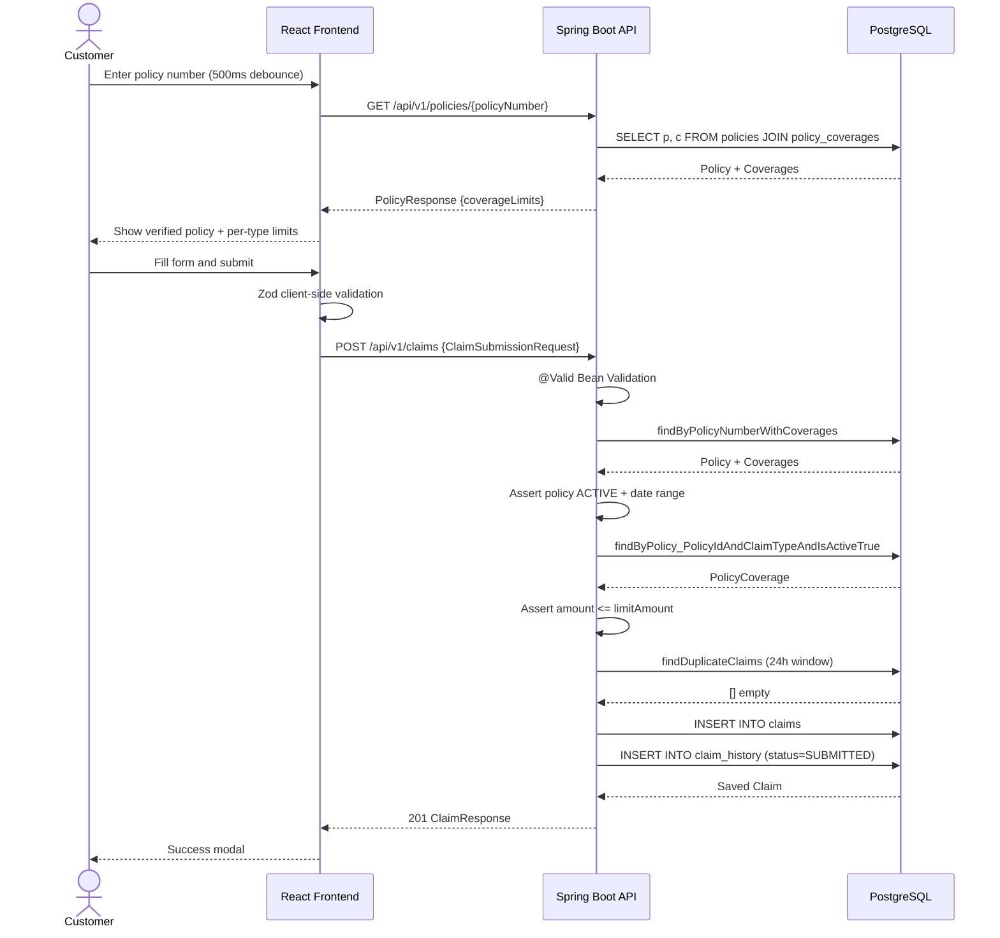
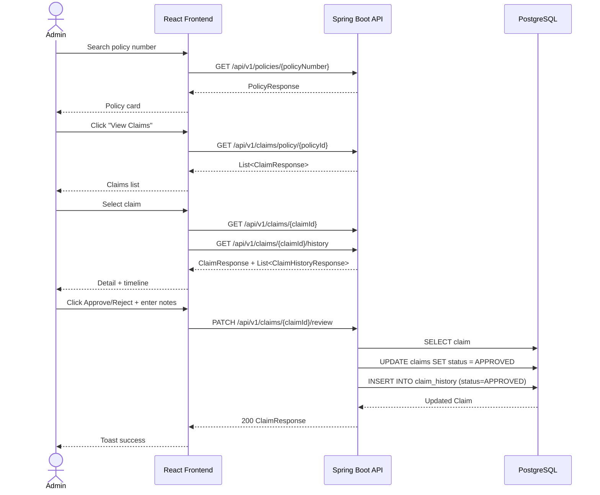
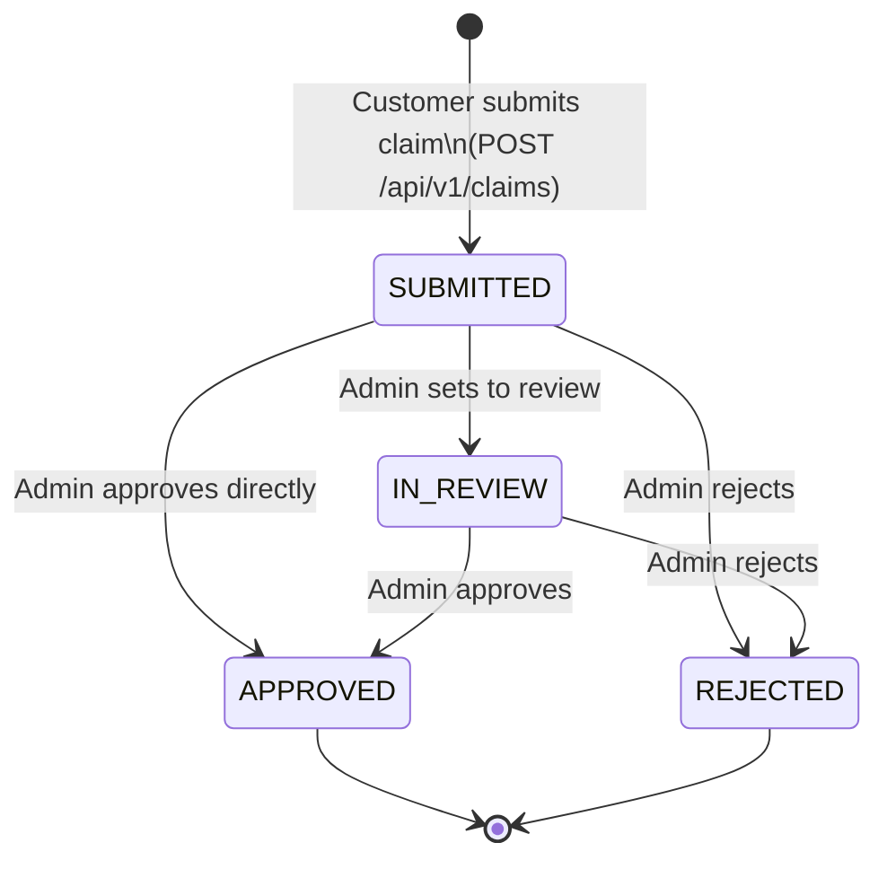

# Low Level Design (LLD)
## Insurance Claim Submission System

**Version:** 1.3  
**Status:** Final  
**Authors:** Engineering Team  
**Last Updated:** March 2026

---

## Document History

| Version | Date       | Changes                                                                              |
|---------|------------|--------------------------------------------------------------------------------------|
| 1.0     | 2026-01-05 | Initial LLD — package structure, entity design, base service contracts (Sprint 1)    |
| 1.1     | 2026-02-02 | Added `ClaimService`, `ClaimController`, all Claim DTO definitions (Sprint 3)        |
| 1.2     | 2026-03-02 | Added `ClaimHistory` entity, timeline query design, history endpoint (Sprint 5)      |
| 1.3     | 2026-03-30 | Added audit trail service, `GlobalExceptionHandler` full detail (Sprint 7)           |

---

## Table of Contents
1. [Package & Module Structure](#1-package--module-structure)
2. [Class Design — Entities](#2-class-design--entities)
3. [Class Design — DTOs](#3-class-design--dtos)
4. [Class Design — Repositories](#4-class-design--repositories)
5. [Class Design — Services](#5-class-design--services)
6. [Class Design — Controllers](#6-class-design--controllers)
7. [Class Design — Validation Layer](#7-class-design--validation-layer)
8. [Class Design — Exception Handling](#8-class-design--exception-handling)
9. [Database Schema (DDL)](#9-database-schema-ddl)
10. [Sequence Diagrams](#10-sequence-diagrams)
11. [State Machine — Claim Status](#11-state-machine--claim-status)
12. [Frontend Architecture](#12-frontend-architecture)
13. [API Error Catalogue](#13-api-error-catalogue)
14. [Business Rules Reference](#14-business-rules-reference)

---

## 1. Package & Module Structure

### Backend (`com.insurance.claim`)

```
com.insurance.claim
├── ClaimSubmissionSystemApplication.java   @SpringBootApplication
├── config/
│   └── OpenApiConfig.java                  SpringDoc bean, API info
├── controller/
│   ├── ClaimController.java                POST/GET/PATCH claims endpoints
│   ├── ClaimHistoryController.java         GET claim history endpoint
│   ├── PolicyController.java               GET policy endpoint
│   └── RootController.java                 Redirect / → /swagger-ui.html
├── dto/
│   ├── ClaimHistoryResponse.java           Response DTO
│   ├── ClaimResponse.java                  Response DTO
│   ├── ClaimReviewRequest.java             Request DTO
│   ├── ClaimSubmissionRequest.java         Request DTO + Bean Validation
│   └── PolicyResponse.java                 Response DTO
├── entity/
│   ├── Claim.java                          @Entity → claims
│   ├── ClaimHistory.java                   @Entity → claim_history
│   ├── ClaimStatus.java                    enum: SUBMITTED|IN_REVIEW|APPROVED|REJECTED
│   ├── ClaimType.java                      enum: MEDICAL|DENTAL|VISION|LIFE|AUTO|HOME|DISABILITY
│   ├── Policy.java                         @Entity → policies
│   ├── PolicyCoverage.java                 @Entity → policy_coverages
│   └── PolicyStatus.java                   enum: ACTIVE|INACTIVE|EXPIRED|CANCELLED|PENDING
├── exception/
│   ├── ClaimNotFoundException.java
│   ├── CoverageExceededException.java
│   ├── DuplicateClaimException.java
│   ├── GlobalExceptionHandler.java         @RestControllerAdvice
│   ├── InvalidClaimTypeException.java
│   ├── PolicyInactiveException.java
│   └── PolicyNotFoundException.java
├── repository/
│   ├── ClaimHistoryRepository.java         JpaRepository<ClaimHistory, Long>
│   ├── ClaimRepository.java                JpaRepository<Claim, Long>
│   ├── PolicyCoverageRepository.java       JpaRepository<PolicyCoverage, Long>
│   └── PolicyRepository.java              JpaRepository<Policy, Long>
├── service/
│   ├── ClaimHistoryService.java            @Service (concrete)
│   ├── ClaimService.java                   interface
│   ├── ClaimServiceImpl.java               @Service @Transactional
│   ├── PolicyService.java                  interface
│   └── PolicyServiceImpl.java              @Service @Transactional(readOnly)
├── util/
│   └── ErrorResponse.java                  Uniform error response wrapper
└── validator/
    ├── IncidentDateValidator.java           ConstraintValidator
    ├── PolicyNumberValidator.java           ConstraintValidator
    ├── ValidIncidentDate.java               @interface (custom annotation)
    └── ValidPolicyNumber.java              @interface (custom annotation)
```

### Frontend (`src/`)

```
src/
├── App.tsx                      Root router + QueryClientProvider
├── main.tsx                     React DOM render entry
├── index.css                    Tailwind base styles
├── api/
│   ├── client.ts                ApiClient class (axios singleton)
│   └── errors.ts                ApiError class + error mapping utils
├── components/
│   ├── ProtectedRoute.tsx       Role-based route guard
│   ├── forms/
│   │   └── ClaimSubmissionForm.tsx   Full claim form with policy verify
│   ├── layout/
│   │   └── Navbar.tsx           Top navigation bar
│   └── ui/
│       ├── Badge.tsx            Status colored badge
│       ├── Button.tsx           Base button with variants
│       ├── Card.tsx             White box container
│       └── Modal.tsx            Overlay modal dialog
├── lib/
│   └── queryClient.ts           TanStack QueryClient instance
├── pages/
│   ├── Home.tsx                 Dashboard (role-aware)
│   ├── LoginPage.tsx            Role selector (demo auth)
│   ├── SubmitClaimPage.tsx      Wraps ClaimSubmissionForm
│   ├── TrackClaimPage.tsx       Search + timeline view
│   └── admin/
│       ├── AdminRoutes.tsx      Nested admin router
│       ├── AdminPoliciesPage.tsx Policy search
│       ├── ClaimDetailPage.tsx  Full claim + review modal
│       └── ClaimListPage.tsx    Claims per policy
├── stores/
│   └── authStore.ts             Zustand auth store
├── types/
│   └── index.ts                 TypeScript interfaces + enums
└── utils/
    └── formatters.ts            Currency, date, datetime formatters
```

---

## 2. Class Design — Entities

### `Policy`

```java
@Entity
@Table(name = "policies")
public class Policy {
    @Id @GeneratedValue(strategy = GenerationType.IDENTITY)
    @Column(name = "policy_id")
    private Long policyId;

    @Column(name = "policy_number", nullable = false, unique = true, length = 20)
    private String policyNumber;

    @Column(name = "customer_id", nullable = false)
    private Long customerId;

    @Enumerated(EnumType.STRING)
    @Column(name = "status", nullable = false)
    private PolicyStatus status;

    @Column(name = "effective_date", nullable = false)
    private LocalDate effectiveDate;

    @Column(name = "expiry_date", nullable = false)
    private LocalDate expiryDate;

    @Column(name = "coverage_limit", nullable = false, precision = 15, scale = 2)
    private BigDecimal coverageLimit;

    @OneToMany(mappedBy = "policy", cascade = CascadeType.ALL, orphanRemoval = true)
    private List<PolicyCoverage> coverages;

    @OneToMany(mappedBy = "policy", cascade = CascadeType.ALL, orphanRemoval = true)
    private List<Claim> claims;
}
```

### `PolicyCoverage`

```java
@Entity
@Table(name = "policy_coverages")
public class PolicyCoverage {
    @Id @GeneratedValue(strategy = GenerationType.IDENTITY)
    @Column(name = "coverage_id")
    private Long coverageId;

    @ManyToOne(fetch = FetchType.LAZY)
    @JoinColumn(name = "policy_id", nullable = false)
    private Policy policy;

    @Enumerated(EnumType.STRING)
    @Column(name = "claim_type", nullable = false)
    private ClaimType claimType;

    @Column(name = "limit_amount", nullable = false, precision = 15, scale = 2)
    private BigDecimal limitAmount;

    @Column(name = "is_active", nullable = false)
    private Boolean isActive;  // default true
}
```

### `Claim`

```java
@Entity
@Table(name = "claims")
public class Claim {
    @Id @GeneratedValue(strategy = GenerationType.IDENTITY)
    @Column(name = "claim_id")
    private Long claimId;

    @ManyToOne(fetch = FetchType.LAZY)
    @JoinColumn(name = "policy_id", nullable = false)
    private Policy policy;

    @Enumerated(EnumType.STRING)
    @Column(name = "claim_type", nullable = false)
    private ClaimType claimType;

    @Column(name = "claim_amount", nullable = false, precision = 15, scale = 2)
    private BigDecimal claimAmount;

    @Column(name = "incident_date", nullable = false)
    private LocalDate incidentDate;

    @Column(name = "description", columnDefinition = "TEXT")
    private String description;

    @Enumerated(EnumType.STRING)
    @Column(name = "status", nullable = false)
    private ClaimStatus status;  // default SUBMITTED

    @CreationTimestamp
    @Column(name = "created_at", nullable = false, updatable = false)
    private LocalDateTime createdAt;

    @UpdateTimestamp
    @Column(name = "updated_at", nullable = false)
    private LocalDateTime updatedAt;

    @OneToMany(mappedBy = "claim", cascade = CascadeType.ALL, orphanRemoval = true)
    private List<ClaimHistory> history;
}
```

### `ClaimHistory`

```java
@Entity
@Table(name = "claim_history")
public class ClaimHistory {
    @Id @GeneratedValue(strategy = GenerationType.IDENTITY)
    @Column(name = "history_id")
    private Long historyId;

    @ManyToOne(fetch = FetchType.LAZY)
    @JoinColumn(name = "claim_id", nullable = false)
    private Claim claim;

    @Enumerated(EnumType.STRING)
    @Column(name = "status", nullable = false)
    private ClaimStatus status;

    @CreationTimestamp
    @Column(name = "timestamp", nullable = false, updatable = false)
    private LocalDateTime timestamp;

    @Column(name = "reviewer_notes", columnDefinition = "TEXT")
    private String reviewerNotes;
}
```

---

## 3. Class Design — DTOs

### `ClaimSubmissionRequest`

| Field | Type | Validation Rules |
|---|---|---|
| `policyNumber` | `String` | `@NotBlank`, `@ValidPolicyNumber` → regex `^POL-[A-Z0-9]{5}$` |
| `claimType` | `ClaimType` | `@NotNull` |
| `claimAmount` | `BigDecimal` | `@NotNull`, `@Positive`, `@DecimalMin("0.01")` |
| `incidentDate` | `LocalDate` | `@NotNull`, `@ValidIncidentDate` → not in future |
| `description` | `String` | `@NotBlank`, `@Size(min=10, max=1000)` |

### `ClaimReviewRequest`

| Field | Type | Validation Rules |
|---|---|---|
| `action` | `ReviewAction` (`APPROVE`/`REJECT`) | `@NotNull` |
| `reviewerNotes` | `String` | none (nullable) |

### `ClaimResponse`

| Field | Type |
|---|---|
| `claimId` | `Long` |
| `policyId` | `Long` |
| `policyNumber` | `String` |
| `claimType` | `ClaimType` |
| `claimAmount` | `BigDecimal` |
| `incidentDate` | `LocalDate` |
| `description` | `String` |
| `status` | `ClaimStatus` |
| `createdAt` | `LocalDateTime` |
| `updatedAt` | `LocalDateTime` |

### `ClaimHistoryResponse`

| Field | Type |
|---|---|
| `historyId` | `Long` |
| `claimId` | `Long` |
| `status` | `ClaimStatus` |
| `timestamp` | `LocalDateTime` |
| `reviewerNotes` | `String` (nullable) |

### `PolicyResponse`

| Field | Type |
|---|---|
| `policyId` | `Long` |
| `policyNumber` | `String` |
| `customerId` | `Long` |
| `status` | `PolicyStatus` |
| `effectiveDate` | `LocalDate` |
| `expiryDate` | `LocalDate` |
| `coverageLimit` | `BigDecimal` |
| `coverageLimits` | `Map<ClaimType, BigDecimal>` (active coverages only) |

---

## 4. Class Design — Repositories

### `PolicyRepository`

```java
public interface PolicyRepository extends JpaRepository<Policy, Long> {
    Optional<Policy> findByPolicyNumber(String policyNumber);
    List<Policy> findByCustomerId(Long customerId);

    @Query("SELECT p FROM Policy p LEFT JOIN FETCH p.coverages WHERE p.policyNumber = :policyNumber")
    Optional<Policy> findByPolicyNumberWithCoverages(@Param("policyNumber") String policyNumber);
}
```

### `PolicyCoverageRepository`

```java
public interface PolicyCoverageRepository extends JpaRepository<PolicyCoverage, Long> {
    Optional<PolicyCoverage> findByPolicy_PolicyIdAndClaimTypeAndIsActiveTrue(
        Long policyId, ClaimType claimType);
}
```

### `ClaimRepository`

```java
public interface ClaimRepository extends JpaRepository<Claim, Long> {
    List<Claim> findByPolicy_PolicyId(Long policyId);
    List<Claim> findByStatus(ClaimStatus status);

    @Query("""
        SELECT c FROM Claim c
        WHERE c.policy.policyId = :policyId
          AND c.claimType = :claimType
          AND c.incidentDate = :incidentDate
          AND c.createdAt >= :since
        """)
    List<Claim> findDuplicateClaims(
        @Param("policyId") Long policyId,
        @Param("claimType") ClaimType claimType,
        @Param("incidentDate") LocalDate incidentDate,
        @Param("since") LocalDateTime since);
}
```

### `ClaimHistoryRepository`

```java
public interface ClaimHistoryRepository extends JpaRepository<ClaimHistory, Long> {
    List<ClaimHistory> findByClaimClaimIdOrderByTimestampDesc(Long claimId);
}
```

---

## 5. Class Design — Services

### `ClaimServiceImpl` — `submitClaim` Logic

```
Input: ClaimSubmissionRequest

Step 1: findByPolicyNumberWithCoverages(policyNumber)
        → throws PolicyNotFoundException if absent

Step 2: assert policy.status == ACTIVE
        → throws PolicyInactiveException

Step 3: assert today >= policy.effectiveDate AND today <= policy.expiryDate
        → throws PolicyInactiveException with expiry message

Step 4: findByPolicy_PolicyIdAndClaimTypeAndIsActiveTrue(policyId, claimType)
        → throws InvalidClaimTypeException if absent

Step 5: assert claimAmount <= coverage.limitAmount
        → throws CoverageExceededException

Step 6: findDuplicateClaims(policyId, claimType, incidentDate, now minus 24h)
        → throws DuplicateClaimException if list is non-empty

Step 7: Build Claim (status=SUBMITTED), save
        Build ClaimHistory (status=SUBMITTED), save (via cascade)

Step 8: return mapToResponse(savedClaim)
```

### `ClaimServiceImpl` — `reviewClaim` Logic

```
Input: claimId, ClaimReviewRequest { action, reviewerNotes }

Step 1: findById(claimId) → throws ClaimNotFoundException if absent

Step 2: Set claim.status = (action == APPROVE) ? APPROVED : REJECTED

Step 3: Build ClaimHistory (status = new status, reviewerNotes), save

Step 4: return mapToResponse(savedClaim)
```

### `PolicyServiceImpl` — `getPolicy` Logic

```
Input: policyNumber

Step 1: findByPolicyNumberWithCoverages(policyNumber)
        → throws PolicyNotFoundException if absent

Step 2: Build Map<ClaimType, BigDecimal>:
        for each coverage where isActive == true:
            map.put(coverage.claimType, coverage.limitAmount)

Step 3: Build and return PolicyResponse
```

---

## 6. Class Design — Controllers

### `ClaimController`

| Method | HTTP | Path | Request | Response | Status |
|---|---|---|---|---|---|
| `submitClaim` | POST | `/api/v1/claims` | `@RequestBody @Valid ClaimSubmissionRequest` | `ClaimResponse` | 201 |
| `getClaimStatus` | GET | `/api/v1/claims/{claimId}` | `@PathVariable Long claimId` | `ClaimResponse` | 200 |
| `reviewClaim` | PATCH | `/api/v1/claims/{claimId}/review` | `@PathVariable`, `@RequestBody @Valid ClaimReviewRequest` | `ClaimResponse` | 200 |
| `getClaimsByPolicy` | GET | `/api/v1/claims/policy/{policyId}` | `@PathVariable Long policyId` | `List<ClaimResponse>` | 200 |

### `ClaimHistoryController`

| Method | HTTP | Path | Request | Response | Status |
|---|---|---|---|---|---|
| `getClaimHistory` | GET | `/api/v1/claims/{claimId}/history` | `@PathVariable Long claimId` | `List<ClaimHistoryResponse>` | 200 |

### `PolicyController`

| Method | HTTP | Path | Request | Response | Status |
|---|---|---|---|---|---|
| `getPolicy` | GET | `/api/v1/policies/{policyNumber}` | `@PathVariable String policyNumber` | `PolicyResponse` | 200 |

---

## 7. Class Design — Validation Layer

### `@ValidPolicyNumber` + `PolicyNumberValidator`

```java
@Constraint(validatedBy = PolicyNumberValidator.class)
@Target({FIELD, PARAMETER})
@Retention(RUNTIME)
public @interface ValidPolicyNumber {
    String message() default "Policy number must match format POL-XXXXX";
}

public class PolicyNumberValidator implements ConstraintValidator<ValidPolicyNumber, String> {
    private static final Pattern PATTERN = Pattern.compile("^POL-[A-Z0-9]{5}$");

    @Override
    public boolean isValid(String value, ConstraintValidatorContext ctx) {
        if (value == null) return true; // @NotBlank handles null
        return PATTERN.matcher(value).matches();
    }
}
```

### `@ValidIncidentDate` + `IncidentDateValidator`

```java
public class IncidentDateValidator implements ConstraintValidator<ValidIncidentDate, LocalDate> {
    @Override
    public boolean isValid(LocalDate date, ConstraintValidatorContext ctx) {
        if (date == null) return true; // @NotNull handles null
        return !date.isAfter(LocalDate.now());
    }
}
```

---

## 8. Class Design — Exception Handling

### `GlobalExceptionHandler` Mapping Table

| Exception Class | HTTP Code | `error` field | Includes `details`? |
|---|---|---|---|
| `MethodArgumentNotValidException` | 400 | `"Validation Failed"` | Yes — per-field messages |
| `PolicyNotFoundException` | 404 | `"Policy Not Found"` | No |
| `ClaimNotFoundException` | 404 | `"Claim Not Found"` | No |
| `DuplicateClaimException` | 409 | `"Duplicate Claim"` | No |
| `CoverageExceededException` | 400 | `"Coverage Exceeded"` | No |
| `InvalidClaimTypeException` | 400 | `"Invalid Claim Type"` | No |
| `PolicyInactiveException` | 400 | `"Policy Inactive"` | No |
| `NoResourceFoundException` | 404 | `"Not Found"` | No |
| `Exception` (catch-all) | 500 | `"Internal Server Error"` | No |

### `ErrorResponse` Shape

```json
{
  "status": 400,
  "error": "Coverage Exceeded",
  "message": "Claim amount 5000.00 exceeds coverage limit 2000.00 for claim type MEDICAL",
  "timestamp": "2026-03-10T10:15:30",
  "details": []
}
```

Validation errors include per-field detail messages:

```json
{
  "status": 400,
  "error": "Validation Failed",
  "message": "Request validation failed",
  "timestamp": "2026-03-10T10:15:30",
  "details": [
    "policyNumber: Policy number must match format POL-XXXXX",
    "claimAmount: must be greater than 0"
  ]
}
```

---

## 9. Database Schema (DDL)

```sql
-- ============================================================
-- Table: policies
-- ============================================================
CREATE TABLE policies (
    policy_id      BIGSERIAL       PRIMARY KEY,
    policy_number  VARCHAR(20)     NOT NULL UNIQUE,
    customer_id    BIGINT          NOT NULL,
    status         VARCHAR(20)     NOT NULL,
    effective_date DATE            NOT NULL,
    expiry_date    DATE            NOT NULL,
    coverage_limit NUMERIC(15, 2)  NOT NULL
);

-- ============================================================
-- Table: policy_coverages
-- ============================================================
CREATE TABLE policy_coverages (
    coverage_id  BIGSERIAL       PRIMARY KEY,
    policy_id    BIGINT          NOT NULL REFERENCES policies(policy_id) ON DELETE CASCADE,
    claim_type   VARCHAR(20)     NOT NULL,
    limit_amount NUMERIC(15, 2)  NOT NULL,
    is_active    BOOLEAN         NOT NULL DEFAULT TRUE
);

-- ============================================================
-- Table: claims
-- ============================================================
CREATE TABLE claims (
    claim_id      BIGSERIAL       PRIMARY KEY,
    policy_id     BIGINT          NOT NULL REFERENCES policies(policy_id),
    claim_type    VARCHAR(20)     NOT NULL,
    claim_amount  NUMERIC(15, 2)  NOT NULL,
    incident_date DATE            NOT NULL,
    description   TEXT,
    status        VARCHAR(20)     NOT NULL DEFAULT 'SUBMITTED',
    created_at    TIMESTAMP       NOT NULL DEFAULT CURRENT_TIMESTAMP,
    updated_at    TIMESTAMP       NOT NULL DEFAULT CURRENT_TIMESTAMP
);

-- ============================================================
-- Table: claim_history
-- ============================================================
CREATE TABLE claim_history (
    history_id     BIGSERIAL   PRIMARY KEY,
    claim_id       BIGINT      NOT NULL REFERENCES claims(claim_id) ON DELETE CASCADE,
    status         VARCHAR(20) NOT NULL,
    timestamp      TIMESTAMP   NOT NULL DEFAULT CURRENT_TIMESTAMP,
    reviewer_notes TEXT
);

-- ============================================================
-- Indices
-- ============================================================
CREATE INDEX idx_claims_policy_id      ON claims(policy_id);
CREATE INDEX idx_claims_status         ON claims(status);
CREATE INDEX idx_claims_created_at     ON claims(created_at);
CREATE INDEX idx_claim_history_claim   ON claim_history(claim_id);
CREATE INDEX idx_policy_coverages_pol  ON policy_coverages(policy_id);
```

---

## 10. Sequence Diagrams

### 10.1 Claim Submission



### 10.2 Claim Review (Admin)



---

## 11. State Machine — Claim Status



Valid transitions:

| From | Action | To |
|---|---|---|
| — | Customer submits | `SUBMITTED` |
| `SUBMITTED` | Admin approves | `APPROVED` |
| `SUBMITTED` | Admin rejects | `REJECTED` |
| `IN_REVIEW` | Admin approves | `APPROVED` |
| `IN_REVIEW` | Admin rejects | `REJECTED` |

Every transition appends a `ClaimHistory` record.

---

## 12. Frontend Architecture

### Component Hierarchy

```
App
├── QueryClientProvider
├── BrowserRouter
│   ├── Navbar (hidden on /login)
│   ├── /login → LoginPage
│   ├── / [PROTECTED] → Home
│   ├── /submit-claim [CUSTOMER] → SubmitClaimPage
│   │   └── ClaimSubmissionForm
│   │       ├── Policy verification (debounced GET)
│   │       ├── ClaimType dropdown (dynamic coverageLimits)
│   │       └── Success/Error Modal
│   ├── /track-claim [CUSTOMER] → TrackClaimPage
│   │   ├── Claim detail Card + Badge
│   │   └── History timeline
│   └── /admin/* [ADMIN]
│       ├── /admin/policies → AdminPoliciesPage
│       ├── /admin/claims/:policyId → ClaimListPage
│       └── /admin/claims/:policyId/:claimId → ClaimDetailPage
│           ├── Claim details card
│           ├── History timeline
│           ├── Approve / Reject buttons
│           └── Review Modal (notes textarea)
```

### Auth Store (Zustand)

```
authStore
├── state.user: AuthUser | null
├── login(role)         → sets user, persists to localStorage
├── logout()            → clears user + localStorage
├── loadFromStorage()   → called on App mount
├── isAuthenticated()   → derived
├── isAdmin()           → derived
└── isCustomer()        → derived
```

### Query Keys Convention

| Key | Data |
|---|---|
| `['policy', policyNumber]` | Single policy with coverages |
| `['claims', 'policy', policyId]` | All claims for a policy |
| `['claim', claimId]` | Single claim |
| `['claim-history', claimId]` | History list for a claim |

---

## 13. API Error Catalogue

| Scenario | HTTP | Error | Message Format |
|---|---|---|---|
| Policy number doesn't exist | 404 | `Policy Not Found` | `Policy not found: POL-AB123` |
| Policy is INACTIVE/EXPIRED | 400 | `Policy Inactive` | `Policy POL-AB123 is not active. Current status: EXPIRED` |
| Claim type not in coverage | 400 | `Invalid Claim Type` | `Claim type VISION is not covered under policy POL-AB123 or the coverage is inactive` |
| Amount > coverage limit | 400 | `Coverage Exceeded` | `Claim amount 5000.00 exceeds coverage limit 2000.00 for claim type MEDICAL` |
| Duplicate within 24h | 409 | `Duplicate Claim` | `Duplicate claim detected: policy=POL-AB123, type=MEDICAL, incident_date=2026-03-10` |
| Claim ID not found | 404 | `Claim Not Found` | `Claim not found with ID: 42` |
| Validation failure | 400 | `Validation Failed` | Per-field messages in `details[]` |
| Unknown endpoint | 404 | `Not Found` | — |
| Unhandled server error | 500 | `Internal Server Error` | — |

---

## 14. Business Rules Reference

| Rule ID | Rule | Enforcement |
|---|---|---|
| BR-01 | Policy number must match `^POL-[A-Z0-9]{5}$` | `@ValidPolicyNumber` (server) + Zod (client) |
| BR-02 | Policy must have `status = ACTIVE` to accept claims | `ClaimServiceImpl.submitClaim` |
| BR-03 | Current date must be within `[effectiveDate, expiryDate]` | `ClaimServiceImpl.submitClaim` |
| BR-04 | Claim type must have an active `PolicyCoverage` entry | `ClaimServiceImpl` → `InvalidClaimTypeException` |
| BR-05 | Claim amount may not exceed the per-type `limitAmount` | `ClaimServiceImpl` → `CoverageExceededException` |
| BR-06 | No duplicate claim (same policy + type + incident date) within 24 hours | `ClaimRepository.findDuplicateClaims` |
| BR-07 | Incident date must not be in the future | `@ValidIncidentDate` (server) + Zod (client) |
| BR-08 | Description must be 10–1000 characters | `@Size` (server) + Zod (client) |
| BR-09 | Claim amount minimum is $0.01 | `@DecimalMin("0.01")` (server) + Zod (client) |
| BR-10 | Every claim status change must produce a `ClaimHistory` record | `ClaimServiceImpl` (all state-changing methods) |
| BR-11 | `ClaimHistory` records are append-only — never deleted or updated | No UPDATE on claim_history |
| BR-12 | Only `SUBMITTED` and `IN_REVIEW` claims can be approved/rejected | Service-layer guard |
