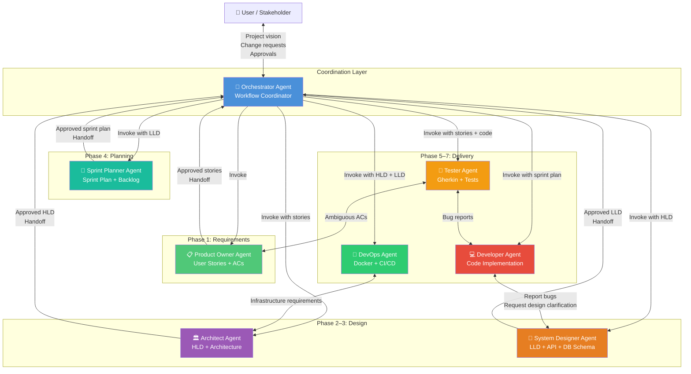
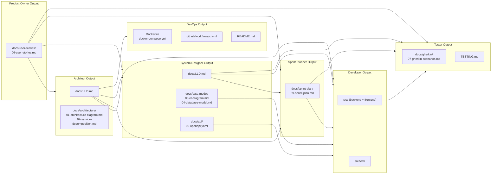

# Agent Interaction Model
## Agile SDLC Custom Agents — Insurance Claim Submission System

**Version:** 1.0  
**Date:** March 2026  
**Status:** Active

---

## Document History

| Version | Date | Changes |
|---|---|---|
| 1.0 | 2026-03-11 | Initial agent interaction model — 7 agents defined, SDLC workflow mapped |

---

## 1. Overview

This document describes the **role-based custom agent system** built to support and replicate the full agile Software Development Lifecycle (SDLC) for the Insurance Claim Submission System — and for any future projects developed in this repository.

The system was originally built using 3 manual prompts. This agent system **reverse engineers** that development process and provides a structured, interactive, multi-agent framework that can:

- Produce all SDLC artefacts from scratch
- Interact with the user at every decision point
- Version all documents automatically
- Be re-run to rebuild the project from the ground up

---

## 2. Agent Roster

| # | Agent | Prompt File | SDLC Phase | Primary Outputs |
|---|---|---|---|---|
| 1 | **Orchestrator** | `agent-orchestrator.prompt.md` | All phases | `docs/PROJECT_MASTER_RECORD.md` |
| 2 | **Product Owner** | `agent-product-owner.prompt.md` | Requirements | `docs/user-stories/`, CHANGELOG |
| 3 | **Architect** | `agent-architect.prompt.md` | Architecture | `docs/HLD.md`, `docs/architecture/` |
| 4 | **System Designer** | `agent-system-designer.prompt.md` | Detailed Design | `docs/LLD.md`, `docs/data-model/`, `docs/api/` |
| 5 | **Sprint Planner** | `agent-sprint-planner.prompt.md` | Planning | `docs/sprint-plan/` |
| 6 | **Developer** | `agent-developer.prompt.md` | Implementation | Source code, tests |
| 7 | **Tester** | `agent-tester.prompt.md` | Testing | `docs/gherkin/`, `TESTING.md` |
| 8 | **DevOps** | `agent-devops.prompt.md` | Infrastructure | `Dockerfile`, CI/CD, `README.md` |

---

## 3. Agent Interaction Diagram



---

## 4. SDLC Phase Flow

```mermaid
flowchart LR
    P0["Phase 0\nProject Inception\n👤 User"]
    P1["Phase 1\nRequirements\n📋 PO Agent"]
    P2["Phase 2\nArchitecture\n🏛️ Architect"]
    P3["Phase 3\nDetailed Design\n🔧 System Designer"]
    P4["Phase 4\nSprint Planning\n📅 Sprint Planner"]
    P5["Phase 5\nDevelopment\n💻 Developer"]
    P6["Phase 6\nTesting\n🧪 Tester"]
    P7["Phase 7\nDevOps\n🚀 DevOps"]

    P0 -->|"Project description"| P1
    P1 -->|"✅ User approved"| P2
    P2 -->|"✅ User approved"| P3
    P3 -->|"✅ User approved"| P4
    P4 -->|"✅ User approved"| P5
    P5 -->|"Sprint complete"| P6
    P6 -->|"Tests pass"| P7
    P7 -->|"✅ Deployed"| End["🎉 Done"]

    style P0 fill:#ecf0f1
    style End fill:#27ae60,color:#fff
```



---

## 5. Document Lineage

Each agent produces documents that downstream agents **depend on**. The following diagram shows which documents feed which agents:



---

## 6. Versioning Convention

All documents produced by agents follow this versioning scheme:

| Change Type | Version Increment | Example | Trigger |
|---|---|---|---|
| Initial creation | `1.0` | `1.0` | Agent first runs |
| New feature/section added | `+0.1` | `1.1 → 1.2` | Sprint added, story added |
| Fundamental scope change | `+1.0` | `1.2 → 2.0` | Architecture overhaul |
| Bug fix / clarification | `+0.0.1` | `1.2 → 1.2.1` | Typo, minor correction |

Every document must include a **Document History** table:

```markdown
## Document History
| Version | Date | Changes |
|---|---|---|
| 1.0 | 2026-01-05 | Initial document |
| 1.1 | 2026-02-10 | Added Sprint 4 scope |
| 2.0 | 2026-03-01 | Architecture redesign |
```

---

## 7. Re-development Capability

To rebuild the project from scratch using the agent system:

```
Step 1: @orchestrator Re-develop project: Insurance Claim Submission System
Step 2: Orchestrator confirms all documents are up-to-date
Step 3: @developer Implement Sprint 1 (from scratch)
Step 4: Continue sprint by sprint
Step 5: @tester Validate each sprint against acceptance criteria
```

**Key principle:** The agents are document-driven. As long as the docs in `docs/` are up-to-date and approved, the Developer Agent can rebuild the entire system from them.

---

## 8. How the Original 3 Prompts Map to Agents

| Original Prompt | Agent Equivalent | Phase |
|---|---|---|
| `instructions-insuranceClaimSubmissionSystem.prompt.md` | Developer Agent + DevOps Agent | Phase 5, 7 |
| `plan-insuranceClaimSubmissionSystem.prompt.md` | Product Owner + Architect + System Designer + Sprint Planner | Phases 1–4 |
| `plan-testingAndCoverage.prompt.md` | Tester Agent + DevOps Agent | Phase 6, 7 |

The agent system **expands** these 3 prompts into a full interactive, multi-agent SDLC framework where each role is clearly separated, documents are versioned, and the user is consulted at every major decision.

---

## 9. Starting a New Project

To start a completely new project using these agents:

```bash
# In GitHub Copilot Chat:
@orchestrator Start a new project: <describe your project>
```

The Orchestrator Agent will:
1. Ask you structured questions about the project
2. Invoke the Product Owner Agent for requirements
3. Guide you through each phase with approval gates
4. Produce all SDLC documents in `docs/`
5. Invoke the Developer Agent to build the code
6. Invoke the Tester Agent to validate it
7. Set up CI/CD with the DevOps Agent

---

## 10. File Location Reference

| Agent | File | Location |
|---|---|---|
| Orchestrator | `agent-orchestrator.prompt.md` | `.github/prompts/` |
| Product Owner | `agent-product-owner.prompt.md` | `.github/prompts/` |
| Architect | `agent-architect.prompt.md` | `.github/prompts/` |
| System Designer | `agent-system-designer.prompt.md` | `.github/prompts/` |
| Sprint Planner | `agent-sprint-planner.prompt.md` | `.github/prompts/` |
| Developer | `agent-developer.prompt.md` | `.github/prompts/` |
| Tester | `agent-tester.prompt.md` | `.github/prompts/` |
| DevOps | `agent-devops.prompt.md` | `.github/prompts/` |
| This document | `00-agent-interaction-model.md` | `docs/agents/` |
| Usage guide | `README.md` | `docs/agents/` |
