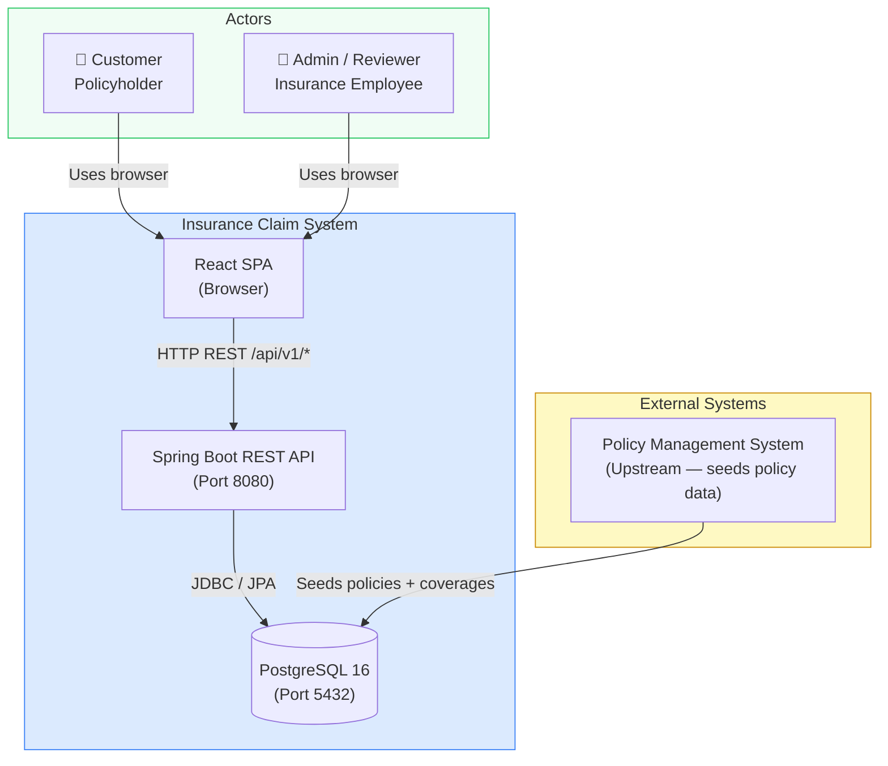
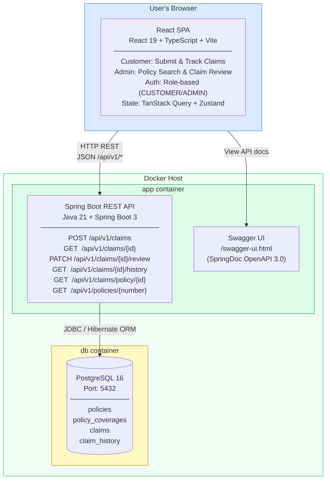
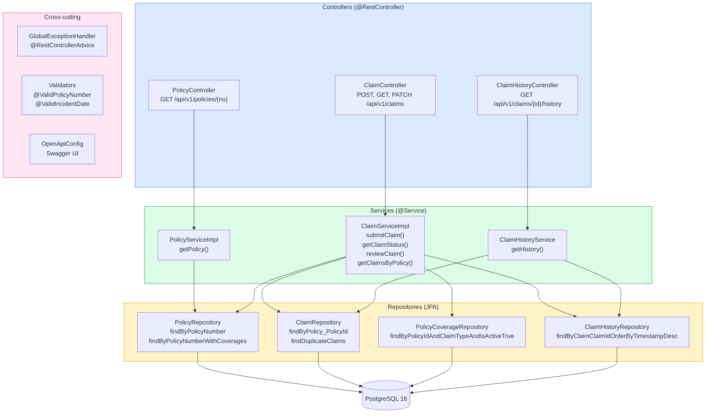
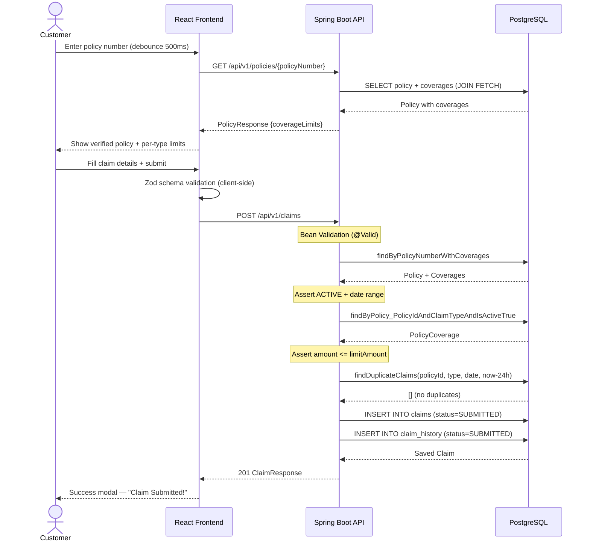
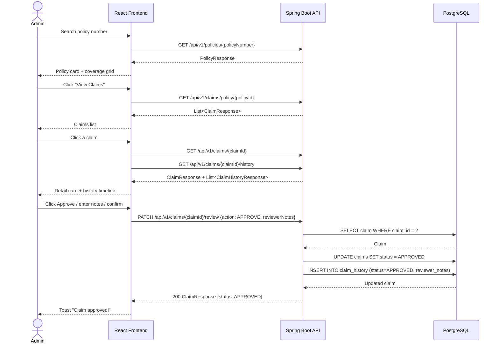
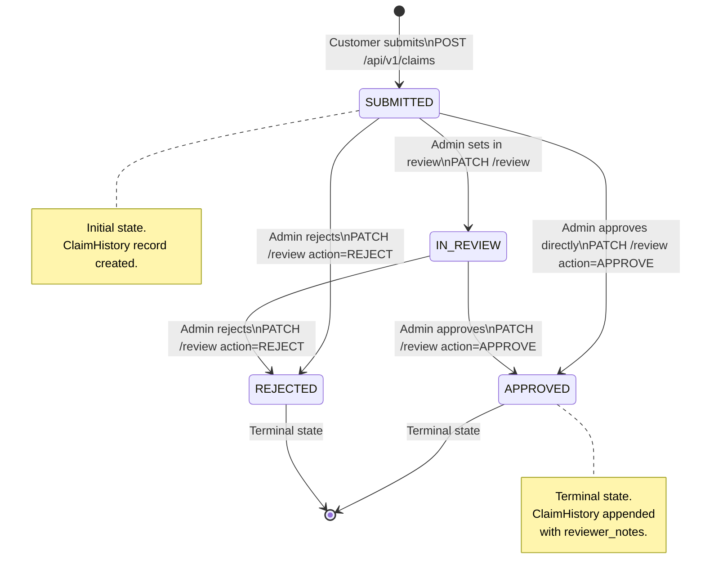
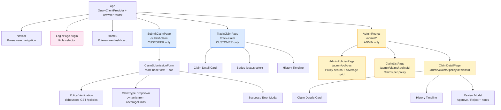
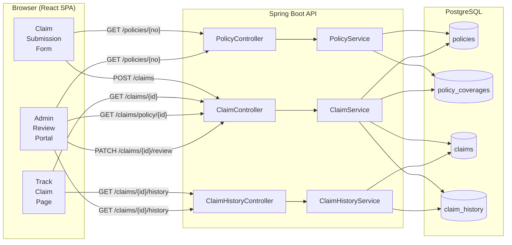
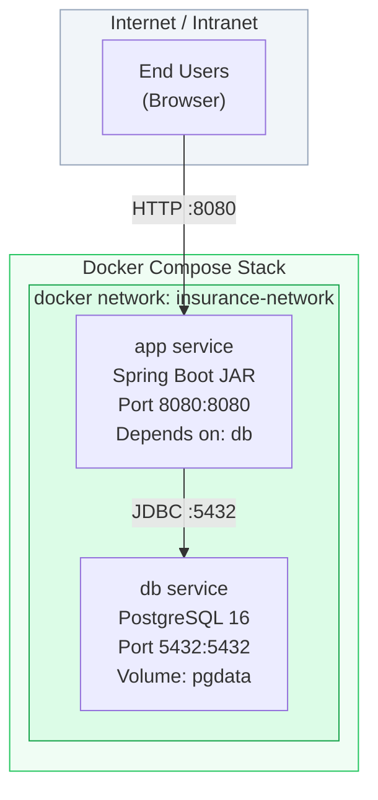

# Architecture Diagrams
## Insurance Claim Submission System

**Version:** 1.1  
**Date:** March 2026

---

## Document History

| Version | Date       | Changes                                                                          |
|---------|------------|----------------------------------------------------------------------------------|
| 1.0     | 2026-01-05 | Initial system context and container diagrams (Sprint 1)                         |
| 1.1     | 2026-02-09 | Updated component diagram — added claim submission and validation components (Sprint 3) |

---

## 1. System Context Diagram

---

## 2. Container Diagram

---

## 3. Backend Component Diagram

---

## 4. Claim Submission — Sequence Diagram

---

## 5. Claim Review — Sequence Diagram

---

## 6. Claim Status State Machine

---

## 7. Frontend Component Tree

---

## 8. Data Flow Diagram

---

## 9. Deployment Architecture

