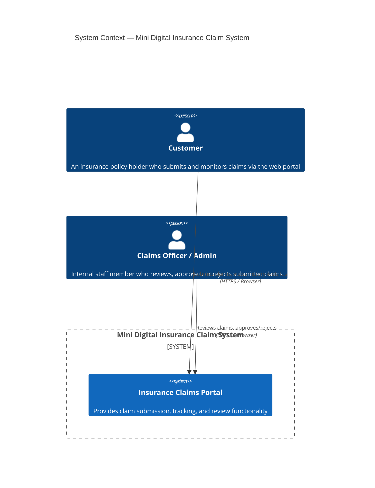
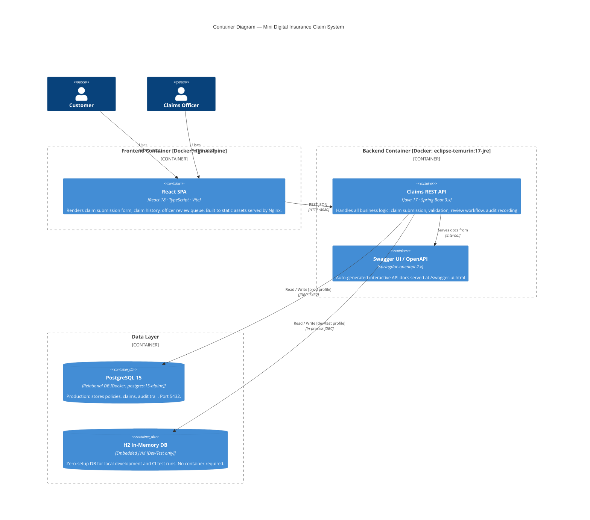
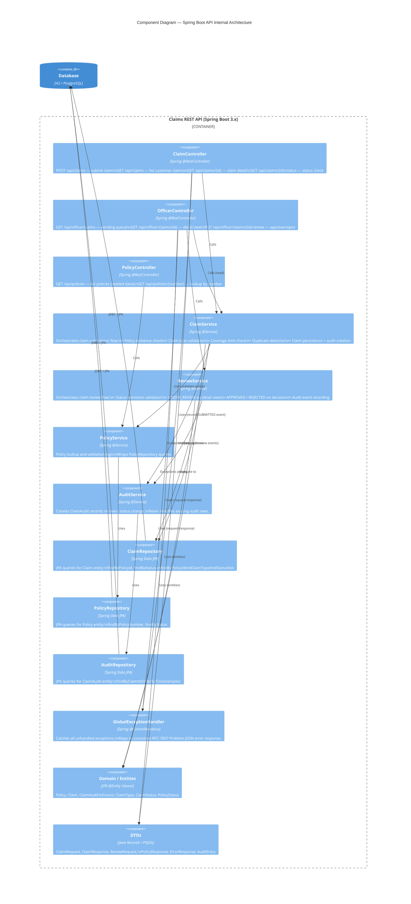
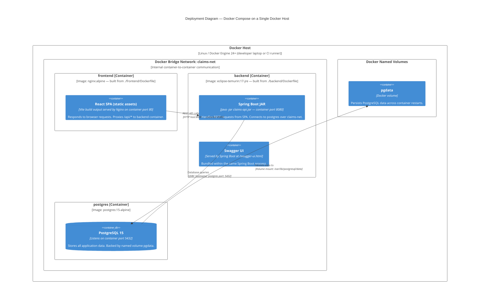

# Architecture Diagrams
## Mini Digital Insurance Claim System

---

| Field | Value |
|---|---|
| **Project** | Mini Digital Insurance Claim System |
| **Document Type** | Architecture Diagrams |
| **Version** | v1.0 |
| **Date** | 2026-03-11 |
| **Author** | Architect Agent |

---

## 1. System Context Diagram

Shows the system in relation to its human actors and external systems.



### Key Points
- **Customer** interacts exclusively through the React SPA
- **Claims Officer** uses the same SPA but navigates to officer-specific routes (e.g. `/officer/claims`)
- No external system integrations exist in the hackathon scope — policy seed data is loaded internally at startup
- The portal boundary encompasses both the frontend SPA and backend API as a single logical system

---

## 2. Container Diagram

Shows the major deployable units (containers) and how they communicate.



### Container Responsibilities

| Container | Technology | Port | Primary Responsibility |
|---|---|---|---|
| React SPA | React 18 + TypeScript + Vite → Nginx | 3000 | User interface for all actors |
| Claims REST API | Spring Boot 3.x JAR | 8080 | All business logic and data access |
| Swagger UI | springdoc-openapi (embedded) | 8080 | API documentation and manual testing |
| PostgreSQL | postgres:15-alpine | 5432 | Durable production data store |
| H2 | In-process (dev/test) | In-JVM | Fast test-time database |

---

## 3. Component Diagram

Shows the internal layered structure of the Spring Boot backend application.



### Layer Descriptions

| Layer | Classes | Pattern |
|---|---|---|
| **Controller** | `ClaimController`, `OfficerController`, `PolicyController` | Spring `@RestController` — HTTP routing, request validation (`@Valid`), response mapping |
| **Service** | `ClaimService`, `ReviewService`, `PolicyService`, `AuditService` | Spring `@Service` — business rules, orchestration, transaction boundaries (`@Transactional`) |
| **Repository** | `ClaimRepository`, `PolicyRepository`, `AuditRepository` | Spring Data JPA `JpaRepository` — query abstraction, no SQL boilerplate |
| **Domain** | `Policy`, `Claim`, `ClaimAudit` + enums | JPA `@Entity` — persistence mapping, column constraints |
| **DTO** | `ClaimRequest`, `ClaimResponse`, `ReviewRequest`, `AuditEntry`, `ErrorResponse` | Java records / POJOs — API contract, decoupled from JPA layer |
| **Cross-cutting** | `GlobalExceptionHandler` | `@ControllerAdvice` — intercepts all exceptions, returns consistent error JSON |

---

## 4. Deployment Diagram

Shows how containers are deployed using Docker Compose on a single host.



### Port Mapping Summary

| Service | Host Port | Container Port | Access From |
|---|---|---|---|
| `frontend` | `3000` | `80` | Browser → `http://localhost:3000` |
| `backend` | `8080` | `8080` | Browser (Swagger) → `http://localhost:8080/swagger-ui.html`; frontend SPA internally |
| `postgres` | `5432` | `5432` | DBA tools / local debugging only; not exposed in production |

### Docker Compose Quick Reference

```yaml
# Abbreviated — see docker-compose.yml for full definition
services:
  frontend:
    build: ./frontend
    ports: ["3000:80"]
    depends_on: [backend]
    networks: [claims-net]

  backend:
    build: ./backend
    ports: ["8080:8080"]
    environment:
      SPRING_DATASOURCE_URL: jdbc:postgresql://postgres:5432/claimsdb
      SPRING_PROFILES_ACTIVE: prod
    depends_on: [postgres]
    networks: [claims-net]

  postgres:
    image: postgres:15-alpine
    ports: ["5432:5432"]
    environment:
      POSTGRES_DB: claimsdb
      POSTGRES_USER: claims_user
      POSTGRES_PASSWORD: claims_pass
    volumes: [pgdata:/var/lib/postgresql/data]
    networks: [claims-net]

volumes:
  pgdata:

networks:
  claims-net:
    driver: bridge
```

---

*End of Architecture Diagrams — Mini Digital Insurance Claim System v1.0*
