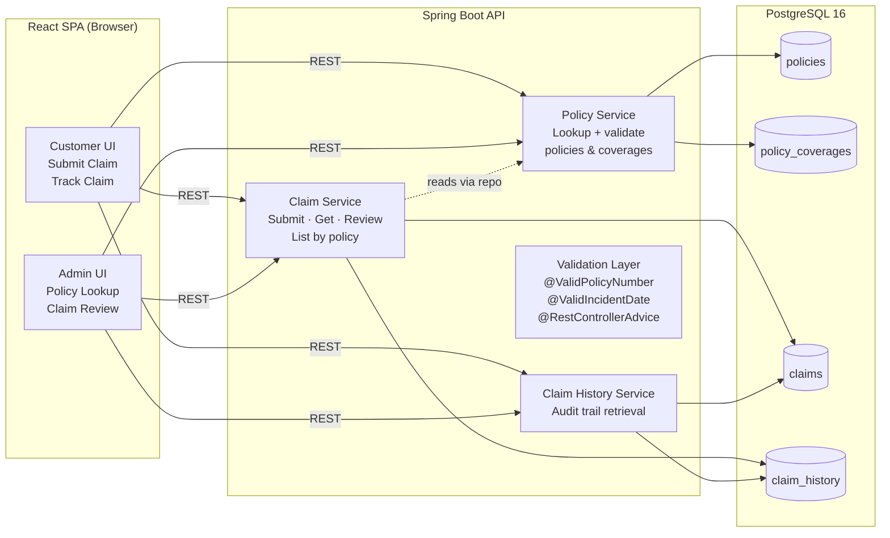
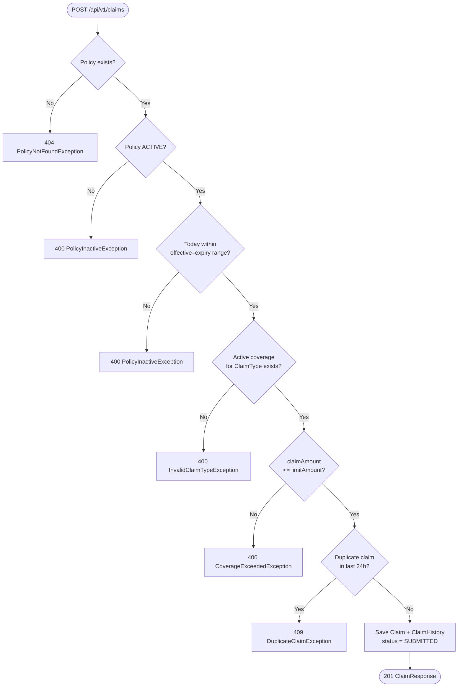
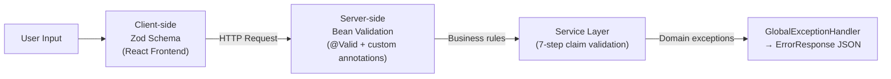
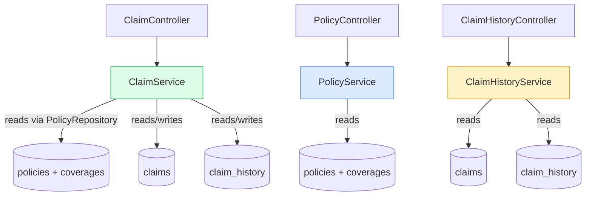
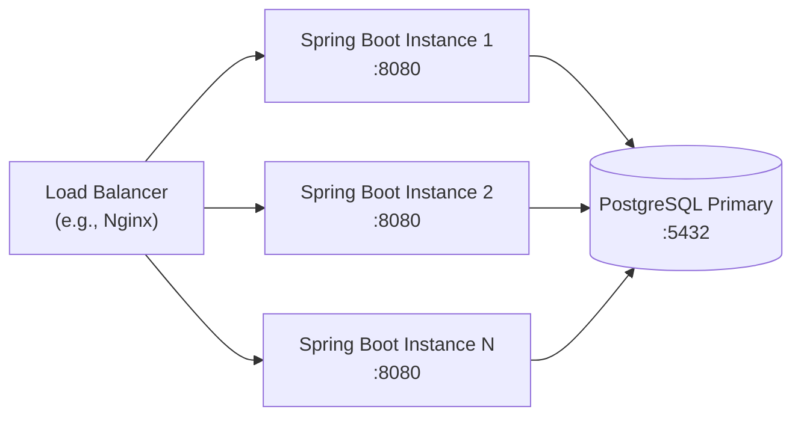

# Service Decomposition
## Insurance Claim Submission System

**Version:** 1.1  
**Date:** March 2026

---

## Document History

| Version | Date       | Changes                                                                                |
|---------|------------|----------------------------------------------------------------------------------------|
| 1.0     | 2026-01-05 | Initial service map — PolicyService and Auth/Navigation boundary defined (Sprint 1)    |
| 1.1     | 2026-03-02 | Added `ClaimHistoryService` decomposition and audit trail service boundary (Sprint 5)   |

---

## Overview

The system is built as a **modular monolith** — a single deployable Spring Boot application internally divided into clearly separated service modules, each owning a distinct business domain. The frontend is a separate SPA communicating exclusively over REST.

---

## 1. Service Map



---

## 2. Service Responsibility Matrix

| Service | Owns | Does NOT own |
|---|---|---|
| **Policy Service** | Policy lookup, coverage map building, policy status validity | Claim creation, claim status management |
| **Claim Service** | Claim lifecycle (submit → review → terminal), 7-step validation chain, duplicate detection | Policy data management, history presentation |
| **Claim History Service** | Audit trail retrieval | Writing history records (done by Claim Service) |
| **Validation Layer** | Input format/type validation (Bean Validation), global error mapping | Business logic validation (lives in services) |

---

## 3. Policy Service

**Class:** `PolicyServiceImpl` implements `PolicyService`  
**Endpoint:** `GET /api/v1/policies/{policyNumber}`

### Responsibilities
- Look up a policy and its `PolicyCoverage` records in a single `JOIN FETCH` query
- Build `coverageLimits` map (`Map<ClaimType, BigDecimal>`) filtered to active coverages only
- Return `PolicyResponse`

### Key Design Decision
`JOIN FETCH` eliminates N+1: coverages are loaded together with the policy in one SQL query.

```mermaid
flowchart TD
    IN([GET /api/v1/policies/{policyNumber}]) --> Q1{Policy exists?}
    Q1 -->|No| E1[404 PolicyNotFoundException]
    Q1 -->|Yes| MAP[Build coverageLimits map\nfrom active PolicyCoverages]
    MAP --> OUT([200 PolicyResponse])
```

---

## 4. Claim Service

**Class:** `ClaimServiceImpl` implements `ClaimService`

### Submit Claim — 7-Step Validation Chain



### Review Claim

```mermaid
flowchart TD
    A([PATCH /api/v1/claims/{id}/review]) --> B{Claim exists?}
    B -->|No| E1[404 ClaimNotFoundException]
    B -->|Yes| C{action?}
    C -->|APPROVE| D1[Set status = APPROVED]
    C -->|REJECT| D2[Set status = REJECTED]
    D1 --> E[Append ClaimHistory record\nwith reviewerNotes]
    D2 --> E
    E --> OUT([200 ClaimResponse])
```

---

## 5. Claim History Service

**Class:** `ClaimHistoryService` (concrete `@Service`)  
**Endpoint:** `GET /api/v1/claims/{claimId}/history`

### Design
- **Read-only** from this service — writes happen only in `ClaimServiceImpl`
- Guards with `existsById()` before querying history to provide a proper 404 for missing claims
- Returns records newest-first (`ORDER BY timestamp DESC`)

---

## 6. Validation Layer

### Two-Layer Validation Strategy



| Layer | Technology | What it validates |
|---|---|---|
| Client (Zod) | TypeScript schema | Policy number format, non-future date, amount > 0, description length, coverage limit check |
| Server (Bean Validation) | Jakarta `@Valid` + custom | Same format rules + custom annotations |
| Service (business logic) | Java service methods | Policy status, date range, coverage existence, amount vs limit, duplicate detection |
| Global handler | `@RestControllerAdvice` | Maps all failures to uniform `ErrorResponse` |

---

## 7. Inter-Service Dependency Graph



> Note: `ClaimService` accesses `PolicyRepository` directly (not via `PolicyService`) to keep both operations within a single `@Transactional` boundary and avoid cross-service circular dependency.

---

## 8. Scalability Pattern

The API is **stateless by design** — no HTTP session, no in-memory cache. All state lives in PostgreSQL. This allows horizontal scaling behind a load balancer:


