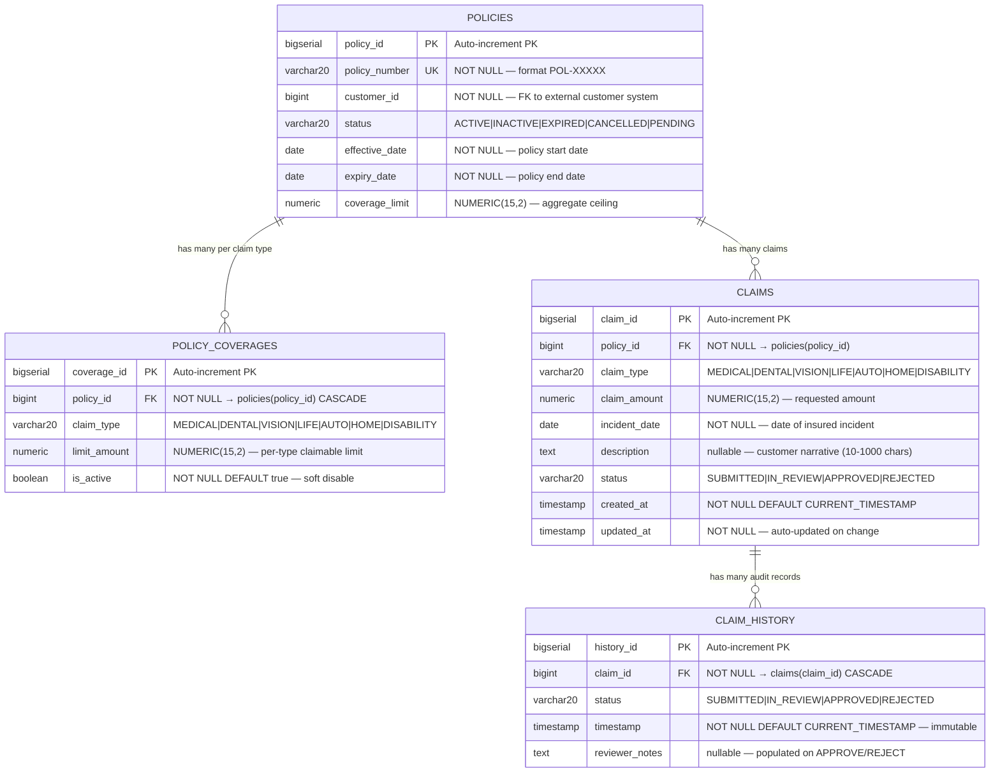
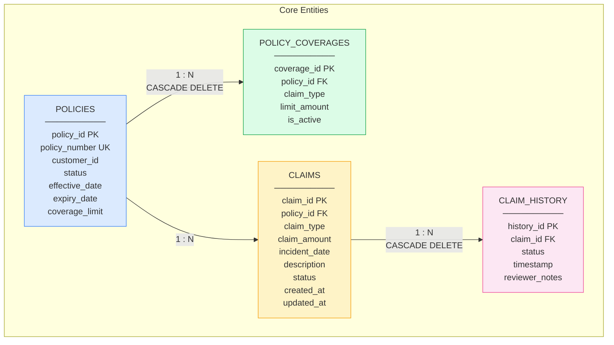
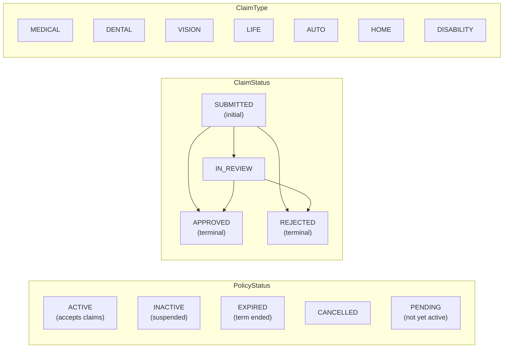
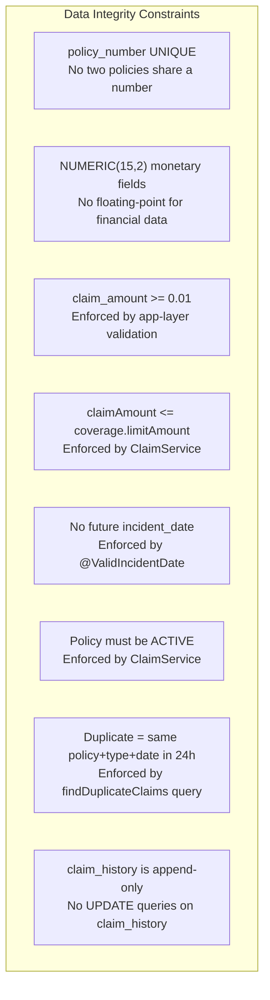

# Entity-Relationship Diagram
## Insurance Claim Submission System

**Version:** 1.2  
**Date:** March 2026

---

## Document History

| Version | Date       | Changes                                                                      |
|---------|------------|------------------------------------------------------------------------------|
| 1.0     | 2026-01-05 | Initial ER diagram — `policies` and `policy_coverages` entities (Sprint 1)   |
| 1.1     | 2026-02-02 | Added `claims` entity with policy FK and coverage-type relationship (Sprint 3) |
| 1.2     | 2026-03-02 | Added `claim_history` entity with claim FK (Sprint 5)                        |

---

## 1. ER Diagram (Mermaid)

---

## 2. Entity Relationship Overview

---

## 3. Relationship Definitions

### `POLICIES` → `POLICY_COVERAGES` (One-to-Many)

| Aspect | Detail |
|---|---|
| **Cardinality** | 1 policy has 0..N coverages |
| **Meaning** | Each policy can cover multiple claim types (MEDICAL, AUTO, etc.) with individual dollar limits |
| **FK** | `policy_coverages.policy_id → policies.policy_id` |
| **Delete behaviour** | `ON DELETE CASCADE` — removing a policy removes its coverage entries |
| **Soft disable** | `is_active = false` deactivates a coverage type without deleting the record |

### `POLICIES` → `CLAIMS` (One-to-Many)

| Aspect | Detail |
|---|---|
| **Cardinality** | 1 policy has 0..N claims |
| **Meaning** | A policyholder can submit multiple claims against the same policy over its lifetime |
| **FK** | `claims.policy_id → policies.policy_id` |
| **Delete behaviour** | Restricted — claims are financial records and must not be cascade-deleted |

### `CLAIMS` → `CLAIM_HISTORY` (One-to-Many)

| Aspect | Detail |
|---|---|
| **Cardinality** | 1 claim has 1..N history records |
| **Meaning** | Every claim starts with one `SUBMITTED` record; each subsequent status change appends a new record |
| **FK** | `claim_history.claim_id → claims.claim_id` |
| **Delete behaviour** | `ON DELETE CASCADE` — if a claim is administratively deleted, its history is removed too |
| **Write behaviour** | **Append-only** — no UPDATE operations on `claim_history` rows |

---

## 4. Allowed Enum Values

---

## 5. Index Strategy

| Index Name | Table | Column(s) | Purpose |
|---|---|---|---|
| *(implicit UNIQUE)* | `policies` | `policy_number` | Fast lookup by business key |
| `idx_claims_policy_id` | `claims` | `policy_id` | Join/filter claims by policy |
| `idx_claims_status` | `claims` | `status` | Admin review queue filtering |
| `idx_claims_created_at` | `claims` | `created_at` | Duplicate detection query (24h window) |
| `idx_claim_history_claim` | `claim_history` | `claim_id` | Fetch history ordered by timestamp |
| `idx_policy_coverages_pol` | `policy_coverages` | `policy_id` | Join coverages to policy |

---

## 6. Data Integrity Rules

