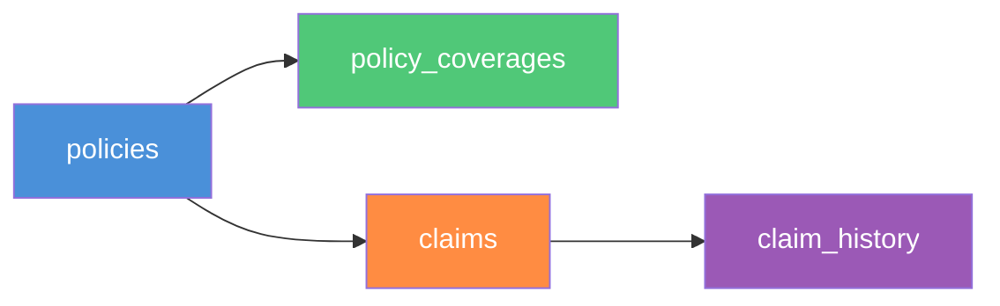

# Database Model
## Insurance Claim Submission System

**Version:** 1.2  
**Date:** March 2026  
**Database:** PostgreSQL 16

---

## Document History

| Version | Date       | Changes                                                                           |
|---------|------------|-----------------------------------------------------------------------------------|
| 1.0     | 2026-01-05 | Initial DDL — `policies` and `policy_coverages` tables defined (Sprint 1)         |
| 1.1     | 2026-02-02 | Added `claims` table DDL, duplicate-check composite index (Sprint 3)             |
| 1.2     | 2026-03-02 | Added `claim_history` table DDL, foreign key to claims (Sprint 5)                |

---

## 1. Schema Overview



---

## 2. DDL — Full Table Definitions

```sql
-- ============================================================
-- SCHEMA: Insurance Claim Submission System
-- Database: PostgreSQL 16
-- Version: 1.0
-- ============================================================

-- ----------------------------------------------------------
-- TABLE: policies
-- ----------------------------------------------------------
CREATE TABLE IF NOT EXISTS policies (
    policy_id      BIGSERIAL      PRIMARY KEY,
    policy_number  VARCHAR(20)    NOT NULL UNIQUE,
    customer_id    BIGINT         NOT NULL,
    status         VARCHAR(20)    NOT NULL
                        CHECK (status IN ('ACTIVE','INACTIVE','EXPIRED','CANCELLED','PENDING')),
    effective_date DATE           NOT NULL,
    expiry_date    DATE           NOT NULL,
    coverage_limit NUMERIC(15,2)  NOT NULL CHECK (coverage_limit >= 0),
    created_at     TIMESTAMP      NOT NULL DEFAULT NOW(),
    updated_at     TIMESTAMP      NOT NULL DEFAULT NOW(),
    CONSTRAINT chk_policy_dates CHECK (expiry_date > effective_date)
);

-- ----------------------------------------------------------
-- TABLE: policy_coverages
-- ----------------------------------------------------------
CREATE TABLE IF NOT EXISTS policy_coverages (
    coverage_id   BIGSERIAL      PRIMARY KEY,
    policy_id     BIGINT         NOT NULL
                        REFERENCES policies(policy_id) ON DELETE CASCADE,
    claim_type    VARCHAR(20)    NOT NULL
                        CHECK (claim_type IN ('MEDICAL','DENTAL','VISION','LIFE','AUTO','HOME','DISABILITY')),
    limit_amount  NUMERIC(15,2)  NOT NULL CHECK (limit_amount >= 0),
    is_active     BOOLEAN        NOT NULL DEFAULT TRUE,
    CONSTRAINT uq_policy_claim_type UNIQUE (policy_id, claim_type)
);

-- ----------------------------------------------------------
-- TABLE: claims
-- ----------------------------------------------------------
CREATE TABLE IF NOT EXISTS claims (
    claim_id      BIGSERIAL      PRIMARY KEY,
    policy_id     BIGINT         NOT NULL
                        REFERENCES policies(policy_id) ON DELETE RESTRICT,
    claim_type    VARCHAR(20)    NOT NULL
                        CHECK (claim_type IN ('MEDICAL','DENTAL','VISION','LIFE','AUTO','HOME','DISABILITY')),
    claim_amount  NUMERIC(15,2)  NOT NULL CHECK (claim_amount > 0),
    incident_date DATE           NOT NULL,
    description   VARCHAR(1000)  NOT NULL,
    status        VARCHAR(20)    NOT NULL DEFAULT 'SUBMITTED'
                        CHECK (status IN ('SUBMITTED','IN_REVIEW','APPROVED','REJECTED')),
    created_at    TIMESTAMP      NOT NULL DEFAULT NOW(),
    updated_at    TIMESTAMP      NOT NULL DEFAULT NOW()
);

-- ----------------------------------------------------------
-- TABLE: claim_history
-- ----------------------------------------------------------
CREATE TABLE IF NOT EXISTS claim_history (
    history_id      BIGSERIAL      PRIMARY KEY,
    claim_id        BIGINT         NOT NULL
                          REFERENCES claims(claim_id) ON DELETE CASCADE,
    status          VARCHAR(20)    NOT NULL
                          CHECK (status IN ('SUBMITTED','IN_REVIEW','APPROVED','REJECTED')),
    timestamp       TIMESTAMP      NOT NULL DEFAULT NOW(),
    reviewer_notes  VARCHAR(2000)
);
```

---

## 3. Index Definitions

```sql
-- policies: quick lookup by policy number (used in every claim submission)
CREATE INDEX IF NOT EXISTS idx_policies_policy_number ON policies(policy_number);

-- policies: lookup by customer for customer dashboard
CREATE INDEX IF NOT EXISTS idx_policies_customer_id ON policies(customer_id);

-- claims: list all claims for a given policy
CREATE INDEX IF NOT EXISTS idx_claims_policy_id ON claims(policy_id);

-- claims: duplicate detection within 24h window
CREATE INDEX IF NOT EXISTS idx_claims_policy_type_created
    ON claims(policy_id, claim_type, created_at DESC);

-- claims: filter by status (admin dashboard)
CREATE INDEX IF NOT EXISTS idx_claims_status ON claims(status);

-- claim_history: fetch all history for a single claim ordered by time
CREATE INDEX IF NOT EXISTS idx_claim_history_claim_id_timestamp
    ON claim_history(claim_id, timestamp ASC);
```

---

## 4. Enum Values Reference

### `policies.status`

| Value | Description |
|---|---|
| `ACTIVE` | Policy is current and claims can be submitted |
| `INACTIVE` | Policy is paused; claims not accepted |
| `EXPIRED` | Policy expiry date has passed |
| `CANCELLED` | Policy was cancelled before expiry |
| `PENDING` | Policy not yet effective |

### `policy_coverages.claim_type` / `claims.claim_type`

| Value | Description |
|---|---|
| `MEDICAL` | Medical and hospital expenses |
| `DENTAL` | Dental treatment and surgery |
| `VISION` | Vision care and eyewear |
| `LIFE` | Life insurance benefit |
| `AUTO` | Vehicle damage and repair |
| `HOME` | Property and home damage |
| `DISABILITY` | Disability income replacement |

### `claims.status`

| Value | Description | Terminal? |
|---|---|---|
| `SUBMITTED` | Claim received; awaiting review | No |
| `IN_REVIEW` | Claim under active review | No |
| `APPROVED` | Claim approved | **Yes** |
| `REJECTED` | Claim rejected | **Yes** |

---

## 5. Constraints Summary

| Table | Constraint | Type | Rule |
|---|---|---|---|
| `policies` | `chk_policy_dates` | CHECK | `expiry_date > effective_date` |
| `policies` | `policies_policy_number_key` | UNIQUE | One record per policy number |
| `policy_coverages` | `uq_policy_claim_type` | UNIQUE | One coverage type per policy |
| `policy_coverages` | `policy_coverages_policy_id_fkey` | FK | CASCADE DELETE with policy |
| `claims` | `claims_policy_id_fkey` | FK | RESTRICT DELETE (preserve history) |
| `claims` | `chk_claim_amount` | CHECK | `claim_amount > 0` |
| `claim_history` | `claim_history_claim_id_fkey` | FK | CASCADE DELETE with claim |

---

## 6. Entity Relationships

| Relationship | Cardinality | Notes |
|---|---|---|
| Policy → PolicyCoverage | One-to-Many | A policy has multiple coverage types |
| Policy → Claim | One-to-Many | A policy can have multiple claims |
| Claim → ClaimHistory | One-to-Many | Every status change creates a history entry |
| PolicyCoverage.claim_type = Claim.claim_type | Logical FK | No DB FK — enforced in service layer |

---

## 7. Migration Notes

This schema is managed via Spring Boot's `spring.sql.init.mode=always` with the file `src/main/resources/schema.sql`.

- On first startup: tables are created if they do not exist (`CREATE TABLE IF NOT EXISTS`)
- On subsequent startups: schema is idempotent — no data is lost
- Seed data is **not** auto-loaded in production; use the SQL seed script in `docs/synthetic-data/08-synthetic-data-plan.md`
