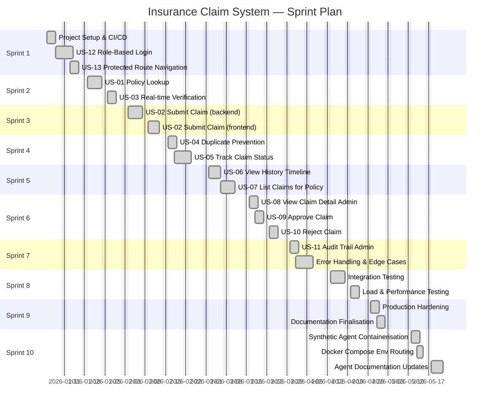
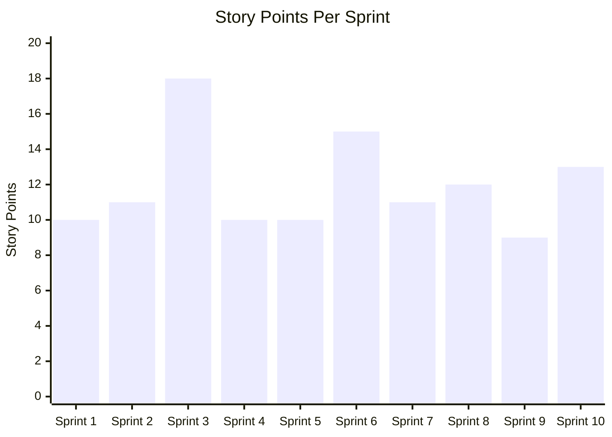

# Sprint Plan
## Insurance Claim Submission System — Feature-by-Feature Delivery

**Version:** 1.3  
**Date:** May 2026  
**Methodology:** Scrum, 2-week sprints  
**Team:** 1 backend engineer, 1 frontend engineer, 1 QA engineer, 1 product owner  
**Definition of Done (DoD):** Code reviewed + merged, unit tests passing, integration tests passing, acceptance criteria verified by PO, documentation updated

---

## Document History

| Version | Date       | Changes                                                                                    |
|---------|------------|--------------------------------------------------------------------------------------------|
| 1.0     | 2026-01-05 | Initial sprint plan — 9 sprints mapped, user story assignments, initial story point estimates |
| 1.1     | 2026-03-02 | Adjusted Sprint 6 scope after Sprint 5 retro — split admin review tasks across Sprint 6–7    |
| 1.2     | 2026-04-13 | Marked Sprints 1–7 complete; updated Sprint 8–9 scope following integration test review     |
| 1.3     | 2026-05-11 | Added Sprint 10 — Synthetic Data Generation Agent integration (Epic 7)                       |

---

## 1. Epic Map

---

## 2. Sprint Overview

---

## 3. Sprint 1 — Foundation & Authentication

**Sprint Goal:** Establish project skeleton, CI/CD pipeline, and role-based authentication flow. The system is accessible with distinct Customer and Admin views.

**User Stories:** US-12, US-13  
**Story Points Total:** 10

### Tasks

| Task ID | Title | Type | Assignee | Points | Status |
|---|---|---|---|---|---|
| T1-01 | Create Maven project structure with Spring Boot | Setup | Backend | 1 | Done |
| T1-02 | Configure PostgreSQL Docker Compose | Setup | Backend | 1 | Done |
| T1-03 | Create `schema.sql` with all 4 tables | Setup | Backend | 2 | Done |
| T1-04 | Create Vite + React + TypeScript frontend project | Setup | Frontend | 1 | Done |
| T1-05 | Set up Zustand auth store with persist | US-12 | Frontend | 2 | Done |
| T1-06 | Build LoginPage with role selection | US-12 | Frontend | 2 | Done |
| T1-07 | Implement `ProtectedRoute` component | US-13 | Frontend | 2 | Done |
| T1-08 | Implement `AdminRoute` component | US-13 | Frontend | 1 | Done |
| T1-09 | Set up GitHub Actions CI pipeline | Setup | DevOps | 2 | Done |
| T1-10 | Write unit tests for auth store | QA | QA | 1 | Done |

**Definition of Done Check:**
- [ ] Login page renders with CUSTOMER / ADMIN role selector
- [ ] Customer route redirects unauthenticated user to login
- [ ] Admin route redirects customer to unauthorised page
- [ ] Auth state persists across page refresh
- [ ] CI pipeline passes all unit tests

---

## 4. Sprint 2 — Policy Management

**Sprint Goal:** Customers can look up their insurance policy and see real-time coverage details before submitting a claim.

**User Stories:** US-01, US-03  
**Story Points Total:** 11

### Tasks

| Task ID | Title | Type | Assignee | Points | Status |
|---|---|---|---|---|---|
| T2-01 | Create `Policy` entity (JPA + Lombok) | US-01 | Backend | 1 | Done |
| T2-02 | Create `PolicyCoverage` entity | US-01 | Backend | 1 | Done |
| T2-03 | Implement `PolicyRepository` with `findByPolicyNumber` | US-01 | Backend | 1 | Done |
| T2-04 | Implement `PolicyService.getPolicyByNumber()` | US-01 | Backend | 2 | Done |
| T2-05 | Implement `GET /api/policies/{policyNumber}` endpoint | US-01 | Backend | 1 | Done |
| T2-06 | Write `PolicyRepositoryTest` | US-01 | QA | 2 | Done |
| T2-07 | Write `PolicyServiceTest` | US-01 | QA | 1 | Done |
| T2-08 | Build `PolicyLookup` React component | US-01 | Frontend | 2 | Done |
| T2-09 | Integrate TanStack Query for `/api/policies/{number}` | US-03 | Frontend | 1 | Done |
| T2-10 | Add Zod validation on policy number input format | US-03 | Frontend | 1 | Done |
| T2-11 | Display coverage grid with active/inactive badges | US-03 | Frontend | 2 | Done |
| T2-12 | Write PolicyControllerIT integration tests | US-01 | QA | 2 | Done |

**Definition of Done Check:**
- [ ] `GET /api/policies/POL-AB123` returns 200 with full policy data
- [ ] `GET /api/policies/INVALID` returns 404 with error message
- [ ] UI shows coverage types, limits, and status badges
- [ ] Inactive coverage is visually distinguished
- [ ] Policy number validates format before API call fires

---

## 5. Sprint 3 — Claim Submission

**Sprint Goal:** An authenticated customer can submit a claim against an active policy with full server-side validation. Invalid submissions are rejected with clear error messages.

**User Stories:** US-02  
**Story Points Total:** 18 (largest sprint — critical path)

### Tasks

| Task ID | Title | Type | Assignee | Points | Status |
|---|---|---|---|---|---|
| T3-01 | Create `Claim` entity with all fields and enums | US-02 | Backend | 2 | Done |
| T3-02 | Create `ClaimHistory` entity | US-02 | Backend | 1 | Done |
| T3-03 | Create `ClaimSubmissionRequest` DTO with Bean Validation | US-02 | Backend | 2 | Done |
| T3-04 | Create `ClaimResponse` DTO | US-02 | Backend | 1 | Done |
| T3-05 | Implement `ClaimRepository` with `existsByPolicyAndTypeAndDate` | US-02 | Backend | 1 | Done |
| T3-06 | Implement `ClaimService.submitClaim()` — 7-step validation | US-02 | Backend | 5 | Done |
| T3-07 | Implement `POST /api/claims` endpoint | US-02 | Backend | 1 | Done |
| T3-08 | Implement `GlobalExceptionHandler` for all error types | US-02 | Backend | 2 | Done |
| T3-09 | Write `ClaimServiceTest` with all validation paths | US-02 | QA | 3 | Done |
| T3-10 | Write `ClaimControllerIT` submission scenarios | US-02 | QA | 2 | Done |
| T3-11 | Build `ClaimSubmissionPage` with React Hook Form | US-02 | Frontend | 3 | Done |
| T3-12 | Add claim type selector and amount with Zod schema | US-02 | Frontend | 2 | Done |
| T3-13 | Show inline Zod validation errors on form | US-02 | Frontend | 1 | Done |
| T3-14 | Show server-side validation errors from API response | US-02 | Frontend | 2 | Done |
| T3-15 | Show success toast on submission and redirect | US-02 | Frontend | 1 | Done |

**Definition of Done Check:**
- [ ] `POST /api/claims` validates all 7 rules and returns correct error codes
- [ ] Frontend shows all validation errors inline
- [ ] Submitted claim appears in list with SUBMITTED status
- [ ] ClaimHistory entry created on every submission
- [ ] Integration tests cover all error paths (404, 400, 422, 409)

---

## 6. Sprint 4 — Duplicate Prevention & Status Tracking

**Sprint Goal:** System prevents duplicate claim submissions within 24 hours for the same policy and claim type. Customers can track the live status of all their submitted claims.

**User Stories:** US-04, US-05  
**Story Points Total:** 10

### Tasks

| Task ID | Title | Type | Assignee | Points | Status |
|---|---|---|---|---|---|
| T4-01 | Refine `ClaimService` 24h duplicate detection logic | US-04 | Backend | 2 | Done |
| T4-02 | Write boundary tests for 24h window (T-1min, exact, T+1min) | US-04 | QA | 2 | Done |
| T4-03 | Return 409 conflict response for duplicate | US-04 | Backend | 1 | Done |
| T4-04 | Handle 409 on frontend with specific error message | US-04 | Frontend | 1 | Done |
| T4-05 | Implement `GET /api/claims/{claimId}` endpoint | US-05 | Backend | 1 | Done |
| T4-06 | Build `ClaimStatusPage` with status badge widget | US-05 | Frontend | 2 | Done |
| T4-07 | Add colour-coded status badge component | US-05 | Frontend | 1 | Done |
| T4-08 | Write integration test for duplicate submission | US-04 | QA | 1 | Done |
| T4-09 | Write unit test for ClaimStatusPage component | US-05 | QA | 1 | Done |

**Definition of Done Check:**
- [ ] Second submission within 24h returns 409
- [ ] Second submission after 24h+ returns 201 (new claim)
- [ ] Status page shows SUBMITTED/IN_REVIEW/APPROVED/REJECTED badge
- [ ] Status badge uses distinct colour per state

---

## 7. Sprint 5 — Claim History & Policy Claims List

**Sprint Goal:** Customers can view the full audit trail of any claim and list all claims filed against a particular policy.

**User Stories:** US-06, US-07  
**Story Points Total:** 10

### Tasks

| Task ID | Title | Type | Assignee | Points | Status |
|---|---|---|---|---|---|
| T5-01 | Implement `GET /api/claims/{claimId}/history` endpoint | US-06 | Backend | 2 | Done |
| T5-02 | Implement `ClaimHistoryRepository.findByClaimIdOrderByTimestamp` | US-06 | Backend | 1 | Done |
| T5-03 | Build `ClaimHistoryTimeline` React component | US-06 | Frontend | 3 | Done |
| T5-04 | Render timeline with status transitions and timestamps | US-06 | Frontend | 2 | Done |
| T5-05 | Implement `GET /api/policies/{policyNumber}/claims` | US-07 | Backend | 2 | Done |
| T5-06 | Build claims list table on PolicyDetailPage | US-07 | Frontend | 2 | Done |
| T5-07 | Add sorting by date and filtering by status | US-07 | Frontend | 1 | Done |
| T5-08 | Write ClaimHistoryControllerIT tests | US-06 | QA | 2 | Done |

**Definition of Done Check:**
- [ ] History endpoint returns events sorted chronologically
- [ ] Timeline UI shows a vertical list of status transitions
- [ ] Reviewer notes visible in history entries where present
- [ ] Policy claims list shows all statuses with counts

---

## 8. Sprint 6 — Admin Claim Review

**Sprint Goal:** Admin users can view claims submitted by customers, approve or reject claims with reviewer notes, and the status change is persisted with a history entry.

**User Stories:** US-08, US-09, US-10  
**Story Points Total:** 15

### Tasks

| Task ID | Title | Type | Assignee | Points | Status |
|---|---|---|---|---|---|
| T6-01 | Implement `PATCH /api/claims/{claimId}/review` endpoint | US-09/10 | Backend | 2 | Done |
| T6-02 | Create `ClaimReviewRequest` DTO with action + notes | US-09/10 | Backend | 1 | Done |
| T6-03 | Add `ReviewAction` enum (APPROVE/REJECT) | US-09/10 | Backend | 1 | Done |
| T6-04 | Validate terminal status — cannot re-review | US-09/10 | Backend | 2 | Done |
| T6-05 | Add HISTORY entry on every review action | US-09/10 | Backend | 1 | Done |
| T6-06 | Write ClaimService review unit tests | US-09/10 | QA | 2 | Done |
| T6-07 | Build `AdminClaimsPage` with claims table for admin | US-08 | Frontend | 3 | Done |
| T6-08 | Build `ClaimReviewModal` with approve/reject buttons | US-09/10 | Frontend | 3 | Done |
| T6-09 | Display reviewer notes field in modal | US-09/10 | Frontend | 1 | Done |
| T6-10 | Optimistic update on approval/rejection | US-09/10 | Frontend | 1 | Done |
| T6-11 | Write ClaimControllerIT for review scenarios | US-09/10 | QA | 2 | Done |

**Definition of Done Check:**
- [ ] APPROVE action transitions SUBMITTED → APPROVED
- [ ] APPROVE action transitions IN_REVIEW → APPROVED
- [ ] REJECT action transitions any non-terminal status → REJECTED
- [ ] Cannot approve/reject already APPROVED or REJECTED claim (returns 409)
- [ ] History entry created on every review action with notes
- [ ] Admin UI shows claim count per status

---

## 9. Sprint 7 — Audit Trail & Error Hardening

**Sprint Goal:** Admin can view the complete audit trail for any claim. All edge cases, error responses, and frontend error boundaries are in place.

**User Stories:** US-11  
**Story Points Total:** 11

### Tasks

| Task ID | Title | Type | Assignee | Points | Status |
|---|---|---|---|---|---|
| T7-01 | Build `AuditTimeline` admin view for claim history | US-11 | Frontend | 3 | Done |
| T7-02 | Show reviewer notes in admin timeline entries | US-11 | Frontend | 1 | Done |
| T7-03 | Load history on `ClaimDetailPage` (admin view) | US-11 | Frontend | 1 | Done |
| T7-04 | Add GlobalExceptionHandler coverage for all known exceptions | Backend | Backend | 2 | Done |
| T7-05 | Add 404 Not Found page for unknown routes | Frontend | Frontend | 1 | Done |
| T7-06 | Add React ErrorBoundary on key page components | Frontend | Frontend | 2 | Done |
| T7-07 | Write `GlobalExceptionHandlerTest` unit tests | QA | QA | 2 | Done |
| T7-08 | Validate all API error shapes match OpenAPI spec | QA | QA | 1 | Done |

**Definition of Done Check:**
- [ ] Admin can view complete claim status journey with timestamps
- [ ] Each history event shows reviewer notes when present
- [ ] Unknown routes render 404 page, not blank screen
- [ ] All 4xx errors display actionable UI messages
- [ ] GlobalExceptionHandler covers all custom exception types

---

## 10. Sprint 8 — Integration & Performance Testing

**Sprint Goal:** All system integration tests pass. Backend and frontend coverage thresholds met. System handles target load without degradation.

**Story Points Total:** 12

### Tasks

| Task ID | Title | Type | Assignee | Points | Status |
|---|---|---|---|---|---|
| T8-01 | Run full ClaimControllerIT suite — fix any failures | QA | QA | 3 | Done |
| T8-02 | Run full PolicyControllerIT suite | QA | QA | 1 | Done |
| T8-03 | Run full ClaimHistoryControllerIT suite | QA | QA | 1 | Done |
| T8-04 | Set up JaCoCo coverage report — achieve ≥ 80% line coverage | QA | QA | 2 | Done |
| T8-05 | Set up Vitest coverage — achieve ≥ 70% frontend coverage | QA | Frontend | 2 | Done |
| T8-06 | Run seed data SQL script on staging environment | QA | DevOps | 1 | Done |
| T8-07 | Execute boundary value test cases from synthetic data plan | QA | QA | 2 | Done |
| T8-08 | Document test failures and create bug tickets | QA | QA | 1 | Done |

---

## 11. Sprint 9 — Production Hardening & Documentation

**Sprint Goal:** System is deployable to production. All documentation is complete, Docker images are stable, and all known bugs are resolved.

**Story Points Total:** 9

### Tasks

| Task ID | Title | Type | Assignee | Points | Status |
|---|---|---|---|---|---|
| T9-01 | Create production `application-prod.yml` | Backend | Backend | 1 | Done |
| T9-02 | Finalise `Dockerfile` for backend | DevOps | DevOps | 1 | Done |
| T9-03 | Finalise `docker-compose.yml` with health checks | DevOps | DevOps | 2 | Done |
| T9-04 | Complete OpenAPI `05-openapi.yaml` spec | Docs | Backend | 1 | Done |
| T9-05 | Finalise all docs in `docs/` folder | Docs | PO | 2 | Done |
| T9-06 | Final smoke test on Docker Compose stack | QA | QA | 1 | Done |
| T9-07 | Create TESTING.md with run instructions | Docs | QA | 1 | Done |

---

## 12. Sprint 10 — Synthetic Data Generation Agent

**Sprint Goal:** Integrate the Synthetic Data Generation Agent into the project. The agent connects to a live PostgreSQL database, introspects the schema, uses an LLM to create a generation plan, produces synthetic rows with Faker, and bulk-inserts them into a `synthetic` schema. Docker Compose supports environment-profile switching so the agent runs automatically in the `test` profile and is excluded from the `prod` profile.

**Epic:** Epic 7 — Synthetic Data Agent  
**Story Points Total:** 13

### Tasks

| Task ID | Title | Type | Assignee | Points | Status |
|---|---|---|---|
| T10-01 | Create `synthetic-agent/` directory with `Dockerfile` and `requirements.txt` | DevOps | DevOps | 2 | Done |
| T10-02 | Update `main.py` sidebar to read DB config from environment variables | Backend | Python Dev | 2 | Done |
| T10-03 | Add `synthetic-agent` service to `docker-compose.yml` with `test` profile | DevOps | DevOps | 2 | Done |
| T10-04 | Create `.env.prod` and `.env.test` environment files with documented usage | DevOps | DevOps | 1 | Done |
| T10-05 | Update `HLD.md` — add Synthetic Data Agent service to system overview | Docs | PO | 2 | Done |
| T10-06 | Update `LLD.md` — add agent component structure and design notes | Docs | Backend | 2 | Done |
| T10-07 | Update architecture diagrams to include synthetic-agent container | Docs | Backend | 1 | Done |
| T10-08 | Update service decomposition doc with agent service boundary | Docs | Backend | 1 | Done |
| T10-09 | Update `CHANGELOG.md` with Sprint 10 entry | Docs | PO | 1 | Done |
| T10-10 | Smoke test: verify agent starts and connects inside `test` profile stack | QA | QA | 1 | Done |

**Definition of Done Check:**
- [ ] `docker compose --env-file .env.test --profile test up --build` starts db + app + synthetic-agent
- [ ] `docker compose --env-file .env.prod up --build` starts db + app only (no agent)
- [ ] Streamlit UI reachable at `http://localhost:8501` in test profile
- [ ] Agent sidebar picks up `PG_HOST`, `PG_DATABASE`, `PG_USER`, `PG_PASSWORD` from Docker env
- [ ] Agent can discover the `public` schema and load synthetic data into the `synthetic` schema
- [ ] All docs updated and version-bumped

---

## 13. Capacity & Velocity Summary

| Sprint | Story Points | Primary Focus |
|---|---|---|
| Sprint 1 | 10 | Foundation + Auth |
| Sprint 2 | 11 | Policy Management |
| Sprint 3 | 18 | Claim Submission (critical) |
| Sprint 4 | 10 | Duplicate Prevention + Status |
| Sprint 5 | 10 | History + Claims List |
| Sprint 6 | 15 | Admin Review |
| Sprint 7 | 11 | Audit Trail + Hardening |
| Sprint 8 | 12 | Integration Testing |
| Sprint 9 | 9 | Production Hardening |
| Sprint 10 | 13 | Synthetic Data Agent Integration |
| **Total** | **119** | |

---

## 14. Risk Register

| Risk ID | Risk | Probability | Impact | Mitigation |
|---|---|---|---|---|
| R-01 | Spring Boot 3 + Java 21 virtual threads unfamiliar | Low | Medium | Spike in Sprint 1 setup |
| R-02 | PostgreSQL 16 JSON support not needed | Low | Low | Standard relational model used |
| R-03 | 24h duplicate detection edge case at midnight | Medium | High | Explicit boundary tests in Sprint 4 |
| R-04 | Frontend Zod v4 API changes | Low | Medium | Pin to Zod 4.x, test in Sprint 3 |
| R-05 | Coverage threshold not met | Medium | Medium | JaCoCo fail-build gate set in Sprint 8 |
| R-06 | LLM API unavailable or SSL cert mismatch in corporate network | Medium | Low | Agent falls back to local generation plan; SSL checkbox in UI |  
| R-07 | Synthetic data FK violations if agent generates child rows before parent | Low | High | Agent generates tables in schema-discovery order; FK-safe ordering documented |
| R-08 | `synthetic` schema collides with `public` schema on prod DB | Low | High | Agent is profile-gated — only runs in `test` profile; never deployed to prod |
