# User Stories & Acceptance Criteria
## Insurance Claim Submission System

**Version:** 1.2  
**Date:** March 2026

---

## Document History

| Version | Date       | Changes                                                                               |
|---------|------------|---------------------------------------------------------------------------------------|
| 1.0     | 2026-01-05 | Initial backlog — all 13 user stories across 6 epics defined (Sprint 1 planning)      |
| 1.1     | 2026-02-16 | Refined AC for US-04 duplicate prevention after Sprint 3 retro; tightened edge cases  |
| 1.2     | 2026-03-30 | Added DoD checklist updates and sprint velocity notes post Sprint 7 review            |

---

## Epic Structure

```mermaid
graph TD
    E1["EPIC 1\nPolicy Management\n(Read-Only Access)"]
    E2["EPIC 2\nClaim Submission"]
    E3["EPIC 3\nClaim Tracking"]
    E4["EPIC 4\nClaim Review &\nAdjudication"]
    E5["EPIC 5\nClaim History &\nAudit Trail"]
    E6["EPIC 6\nAccess Control &\nNavigation"]

    E1 --> US1["US-01 Look up policy"]
    E2 --> US2["US-02 Submit claim"]
    E2 --> US3["US-03 Policy verification in form"]
    E2 --> US4["US-04 Duplicate prevention"]
    E3 --> US5["US-05 Track claim status"]
    E3 --> US6["US-06 View claim history timeline"]
    E4 --> US7["US-07 List claims for review"]
    E4 --> US8["US-08 View claim detail"]
    E4 --> US9["US-09 Approve claim"]
    E4 --> US10["US-10 Reject claim"]
    E5 --> US11["US-11 View audit trail"]
    E6 --> US12["US-12 Role-based login"]
    E6 --> US13["US-13 Protected navigation"]
```

---

## EPIC 1 — Policy Management (Read-Only Access)

### US-01 — Look Up Insurance Policy

> **As an** Admin,  
> **I want to** search for an insurance policy by policy number,  
> **So that** I can see the policy details and coverage limits before reviewing claims.

**Priority:** High | **Story Points:** 3 | **Sprint:** 1

**Acceptance Criteria:**

| AC# | Criteria |
|---|---|
| AC-01-01 | Given a valid policy number in format `POL-XXXXX`, when I submit the search, then the policy details are displayed (policy ID, customer ID, status, effective date, expiry date, overall coverage limit) |
| AC-01-02 | Given a valid policy number, the page also shows per-type coverage limits for all active coverage types (e.g., MEDICAL: $10,000, AUTO: $20,000) |
| AC-01-03 | Given a policy number that does not exist in the system, when I submit the search, then a "Policy not found" error message is displayed |
| AC-01-04 | Given a policy with status `ACTIVE`, the status is shown with a green badge |
| AC-01-05 | Given a policy with any non-ACTIVE status, the status is shown with a red badge |
| AC-01-06 | Given the policy is displayed, a "View Claims" button navigates to the claims list for that policy |

**Definition of Done:** Policy search form works end-to-end, all ACs pass, unit + integration tests written.

---

## EPIC 2 — Claim Submission

### US-02 — Submit an Insurance Claim

> **As a** Customer,  
> **I want to** submit a new insurance claim against my active policy,  
> **So that** I can request reimbursement for a covered incident.

**Priority:** Critical | **Story Points:** 8 | **Sprint:** 2

**Acceptance Criteria:**

| AC# | Criteria |
|---|---|
| AC-02-01 | Given I fill in a valid policy number, claim type, amount within coverage limit, non-future incident date, and description (10-1000 chars), when I submit, then the claim is created with status `SUBMITTED` and I see a success confirmation |
| AC-02-02 | Given the claim is submitted successfully, the system returns a `claimId` that I can use to track the claim |
| AC-02-03 | Given I enter an amount that exceeds the per-type coverage limit, then submission is blocked with a "Coverage Exceeded" error |
| AC-02-04 | Given I enter a future incident date, then submission is blocked with a validation error |
| AC-02-05 | Given I enter a description shorter than 10 characters, then submission is blocked with a validation error |
| AC-02-06 | Given I enter a description longer than 1000 characters, then submission is blocked with a validation error |
| AC-02-07 | Given the policy is not in `ACTIVE` status, then submission is blocked with a "Policy Inactive" error |
| AC-02-08 | Given the selected claim type is not covered by the policy (or the coverage is inactive), then submission is blocked with an "Invalid Claim Type" error |
| AC-02-09 | Given all validations pass, a `ClaimHistory` record with status `SUBMITTED` is also created in the database |

**Definition of Done:** Form to API to DB fully wired, all validation rules enforced at both client and server layers, all ACs pass.

---

### US-03 — Real-Time Policy Verification in Claim Form

> **As a** Customer,  
> **I want to** see my policy details and available coverage types while filling in the claim form,  
> **So that** I know exactly what I can claim and for how much before submitting.

**Priority:** High | **Story Points:** 5 | **Sprint:** 2

**Acceptance Criteria:**

| AC# | Criteria |
|---|---|
| AC-03-01 | Given I type a policy number in the form, after a 500ms debounce the system automatically looks up the policy |
| AC-03-02 | Given the policy is found and `ACTIVE`, a green "verified" section appears showing expiry date and per-type coverage limits |
| AC-03-03 | Given the policy is found but NOT `ACTIVE`, a red error message is shown and form submission is blocked |
| AC-03-04 | Given the policy number does not exist, a red "Policy not found" message is shown |
| AC-03-05 | Given the policy is verified, the claim type dropdown is populated with only the covered claim types and their limits |
| AC-03-06 | Given a claim type is selected and I enter an amount exceeding its limit, an inline error shows the limit and blocks form submission |

---

### US-04 — Duplicate Claim Prevention

> **As the** System,  
> **I want to** detect and reject duplicate claim submissions,  
> **So that** fraudulent or accidental duplicate claims are prevented.

**Priority:** High | **Story Points:** 3 | **Sprint:** 2

**Acceptance Criteria:**

| AC# | Criteria |
|---|---|
| AC-04-01 | Given a claim with the same policy number, claim type, and incident date was submitted within the last 24 hours, when I submit a new claim with identical details, then a 409 Conflict error is returned with message "Duplicate claim detected" |
| AC-04-02 | Given the same policy + type + incident date was submitted more than 24 hours ago, a new claim with those details is accepted |
| AC-04-03 | Given the frontend receives a 409 error, a user-friendly "Duplicate claim detected within 24 hours" message is displayed |

---

## EPIC 3 — Claim Tracking

### US-05 — Track Claim Status

> **As a** Customer,  
> **I want to** look up my claim by its ID and see its current status,  
> **So that** I know whether my claim has been approved, rejected, or is still under review.

**Priority:** High | **Story Points:** 3 | **Sprint:** 3

**Acceptance Criteria:**

| AC# | Criteria |
|---|---|
| AC-05-01 | Given I enter a valid claim ID and search, the claim details are displayed: policy number, claim type, amount, incident date, submission date, description |
| AC-05-02 | Given the claim is displayed, its status is shown as a colour-coded badge (yellow=SUBMITTED, blue=IN_REVIEW, green=APPROVED, red=REJECTED) |
| AC-05-03 | Given I enter a claim ID that does not exist, a "Claim not found" error is shown |
| AC-05-04 | Given I enter a non-numeric claim ID, the system shows a validation error before making any API call |

---

### US-06 — View Claim History Timeline

> **As a** Customer,  
> **I want to** see the full history of status changes for my claim,  
> **So that** I understand what has happened to my claim and when.

**Priority:** Medium | **Story Points:** 3 | **Sprint:** 3

**Acceptance Criteria:**

| AC# | Criteria |
|---|---|
| AC-06-01 | Given I have loaded a claim, the history timeline is displayed showing all status changes ordered newest first |
| AC-06-02 | Each timeline entry shows: status (colour-coded), timestamp, and reviewer notes (if present) |
| AC-06-03 | The most recent entry is labelled "Current" |
| AC-06-04 | A newly submitted claim shows exactly one history entry: status=SUBMITTED with no reviewer notes |
| AC-06-05 | An approved/rejected claim shows the reviewer notes from the most recent entry |

---

## EPIC 4 — Claim Review & Adjudication

### US-07 — List Claims for a Policy (Admin)

> **As an** Admin,  
> **I want to** view all claims submitted against a specific policy,  
> **So that** I can identify which claims require review.

**Priority:** High | **Story Points:** 3 | **Sprint:** 4

**Acceptance Criteria:**

| AC# | Criteria |
|---|---|
| AC-07-01 | Given I have looked up a policy and clicked "View Claims", all claims for that policy are listed |
| AC-07-02 | Each claim card shows: claim ID, status badge, claim type, amount, incident date, submission date, truncated description |
| AC-07-03 | Each claim card has a "Review" link that navigates to the claim detail page |
| AC-07-04 | If no claims exist for the policy, an empty state message is shown |

---

### US-08 — View Claim Detail (Admin)

> **As an** Admin,  
> **I want to** view the full details of a claim,  
> **So that** I have all information needed to make an approval decision.

**Priority:** High | **Story Points:** 2 | **Sprint:** 4

**Acceptance Criteria:**

| AC# | Criteria |
|---|---|
| AC-08-01 | Given I navigate to a claim detail page, the full claim details are shown: claim ID, policy number, type, amount, incident date, submission date, description, current status |
| AC-08-02 | The claim history timeline is shown alongside the details |
| AC-08-03 | If the claim status is `SUBMITTED` or `IN_REVIEW`, the Approve and Reject buttons are visible |
| AC-08-04 | If the claim status is `APPROVED` or `REJECTED` (terminal states), the Approve and Reject buttons are hidden |

---

### US-09 — Approve a Claim

> **As an** Admin,  
> **I want to** approve an insurance claim,  
> **So that** the claimant's request is accepted and processed for payment.

**Priority:** Critical | **Story Points:** 5 | **Sprint:** 4

**Acceptance Criteria:**

| AC# | Criteria |
|---|---|
| AC-09-01 | Given a claim in `SUBMITTED` or `IN_REVIEW` status, when I click "Approve" and confirm in the modal, the claim status changes to `APPROVED` |
| AC-09-02 | A `ClaimHistory` record with status `APPROVED` and the reviewer notes is appended |
| AC-09-03 | After approval, the status badge on the page updates to green `APPROVED` |
| AC-09-04 | After approval, a success toast notification appears |
| AC-09-05 | After approval, the Approve/Reject buttons are hidden |
| AC-09-06 | Reviewer notes entered in the modal are saved and visible in the history timeline |

---

### US-10 — Reject a Claim

> **As an** Admin,  
> **I want to** reject an insurance claim with a documented reason,  
> **So that** ineligible claims are declined and the claimant is informed of the reason.

**Priority:** Critical | **Story Points:** 5 | **Sprint:** 4

**Acceptance Criteria:**

| AC# | Criteria |
|---|---|
| AC-10-01 | Given a claim in `SUBMITTED` or `IN_REVIEW` status, when I click "Reject", a modal opens for entering rejection notes |
| AC-10-02 | When I confirm rejection, the claim status changes to `REJECTED` |
| AC-10-03 | A `ClaimHistory` record with status `REJECTED` and reviewer notes is appended |
| AC-10-04 | After rejection, the status badge updates to red `REJECTED` |
| AC-10-05 | After rejection, a success toast notification appears |
| AC-10-06 | After rejection, the Approve/Reject buttons are hidden |
| AC-10-07 | The reviewer notes for the rejection are visible in the history timeline |

---

## EPIC 5 — Claim History & Audit Trail

### US-11 — View Claim Audit Trail (Admin)

> **As an** Admin,  
> **I want to** view the complete history of status changes for a claim,  
> **So that** I can see who reviewed it and what actions were taken.

**Priority:** Medium | **Story Points:** 2 | **Sprint:** 5

**Acceptance Criteria:**

| AC# | Criteria |
|---|---|
| AC-11-01 | The history timeline on the admin claim detail page shows all status transitions ordered newest first |
| AC-11-02 | The most recent entry is labelled "Latest" |
| AC-11-03 | Each entry shows status (colour-coded), timestamp (full date + time), and reviewer notes |
| AC-11-04 | The initial `SUBMITTED` entry has no reviewer notes |

---

## EPIC 6 — Access Control & Navigation

### US-12 — Role-Based Login

> **As a** User,  
> **I want to** select my role (Customer or Admin) when logging in,  
> **So that** I am directed to the appropriate interface and features.

**Priority:** High | **Story Points:** 3 | **Sprint:** 1

**Acceptance Criteria:**

| AC# | Criteria |
|---|---|
| AC-12-01 | Given I visit the application, I am presented with a login screen with two options: "Customer" and "Admin / Reviewer" |
| AC-12-02 | Given I select "Customer" and log in, I am redirected to the home dashboard with Customer navigation links (Submit Claim, Track Claim) |
| AC-12-03 | Given I select "Admin" and log in, I am redirected to the home dashboard with Admin navigation links (Admin Dashboard) |
| AC-12-04 | My role selection is persisted in `localStorage` so the session survives a page refresh |
| AC-12-05 | Given I click "Logout", my role is cleared and I am redirected to the login page |

---

### US-13 — Protected Route Navigation

> **As the** System,  
> **I want to** enforce role-based access on all pages,  
> **So that** customers cannot access admin pages and unauthenticated users cannot access any protected page.

**Priority:** High | **Story Points:** 3 | **Sprint:** 1

**Acceptance Criteria:**

| AC# | Criteria |
|---|---|
| AC-13-01 | Given an unauthenticated user navigates to any protected route (e.g., `/submit-claim`), they are redirected to `/login` |
| AC-13-02 | Given a CUSTOMER user navigates to an admin route (e.g., `/admin/policies`), they are redirected to the home page |
| AC-13-03 | Given an ADMIN user navigates to a customer route (e.g., `/submit-claim`), they are redirected to the home page |
| AC-13-04 | The Navbar shows only the navigation links appropriate for the current user's role |
