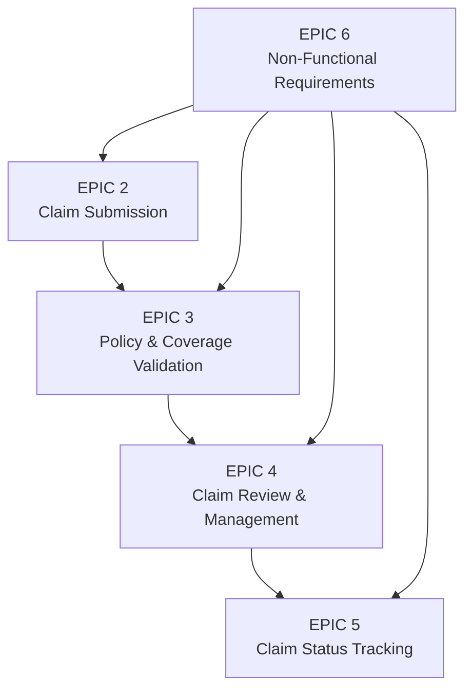

# User Stories — Mini Digital Insurance Claim System

> ⚠️ **Hackathon Dry-Run Scope** — No authentication. No document uploads. All claims are submitted without login.

## Document History

| Version | Date | Author | Changes |
|---|---|---|---|
| 1.0 | 2026-03-11 | PO Agent | Initial backlog — 20 user stories across 6 epics |
| 1.1 | 2026-03-11 | PO Agent | Hackathon scope: removed EPIC 1 (auth), removed US-06 (doc upload); re-numbered to 15 stories; all sprints collapsed to Sprint 1–2 |

---

## Epic Diagram

---

## EPIC 2 — Claim Submission

### US-01 — Submit a New Claim

> **As a** customer,
> **I want to** submit a new insurance claim through a digital form,
> **So that** I can request reimbursement or coverage for a qualifying event.

**Priority:** Critical
**Story Points:** 8
**Epic:** EPIC 2 — Claim Submission
**Sprint:** Sprint 1

**Acceptance Criteria:**

| AC# | Criteria |
|---|---|
| AC-01-01 | Given a customer on the claim submission page, when they fill in all required fields (policy number, claim type, event date, claim amount, description) and submit, then a new claim record is created with status `SUBMITTED` and a 201 response is returned. |
| AC-01-02 | Given a submitted claim, when the claim is created, then a unique claim reference number (e.g., `CLM-YYYYMMDD-XXXX`) is generated and displayed to the customer. |
| AC-01-03 | Given a claim submission form, when a required field is left empty, then the field is highlighted in red and a descriptive validation message is shown before the form is submitted. |
| AC-01-04 | Given a claim submission, when the event date is in the future, then a 400 Bad Request is returned with the message "Event date cannot be in the future." |
| AC-01-05 | Given a claim submission, when the claim amount is zero or negative, then a 400 Bad Request is returned with the message "Claim amount must be greater than zero." |

**Definition of Done:**
- All ACs verified by PO
- Unit tests written and passing
- Integration tests passing
- API/UI changes documented

---

### US-02 — View Submitted Claim History

> **As a** customer,
> **I want to** view a list of all claims I have previously submitted,
> **So that** I can keep track of my claims and their current statuses.

**Priority:** High
**Story Points:** 3
**Epic:** EPIC 2 — Claim Submission
**Sprint:** Sprint 2

**Acceptance Criteria:**

| AC# | Criteria |
|---|---|
| AC-02-01 | Given a customer on the "My Claims" page, when the page loads, then all claims belonging to that customer are displayed with reference number, claim type, submission date, amount, and current status. |
| AC-02-02 | Given a customer with no submitted claims, when the page loads, then an empty state message "You have no submitted claims yet." is displayed. |
| AC-02-03 | Given a customer with more than 10 claims, when the page loads, then results are paginated with 10 claims per page and pagination controls are visible. |
| AC-02-04 | Given a customer viewing their claim list, when they click on a claim, then they are navigated to the claim detail page. |

**Definition of Done:**
- All ACs verified by PO
- Unit tests written and passing
- Integration tests passing
- API/UI changes documented

---

## EPIC 3 — Policy & Coverage Validation

### US-03 — Automated Policy Existence & Status Check

> **As a** system,
> **I want to** verify that the policy number provided in a claim submission belongs to an active policy,
> **So that** only legitimate, in-force policies generate valid claims.

**Priority:** Critical
**Story Points:** 5
**Epic:** EPIC 3 — Policy & Coverage Validation
**Sprint:** Sprint 1

**Acceptance Criteria:**

| AC# | Criteria |
|---|---|
| AC-03-01 | Given a claim submission with a policy number, when the system looks up the policy, then if the policy is not found a 404 response is returned with "Policy not found." |
| AC-03-02 | Given a claim submission with a policy number, when the policy is found but has status `INACTIVE` or `EXPIRED`, then a 422 response is returned with "Policy is not active." |
| AC-03-03 | Given a claim submission with a valid, active policy, when validated, then processing continues to coverage verification without error. |
| AC-03-04 | Given a policy validation failure, when the error is returned, then the validation failure is logged with a structured log entry including policy number, customer ID, and error reason. |

**Definition of Done:**
- All ACs verified by PO
- Unit tests written and passing
- Integration tests passing
- API/UI changes documented

---

### US-04 — Claim Type Eligibility Check

> **As a** system,
> **I want to** verify that the submitted claim type is covered under the customer's policy,
> **So that** claims are only accepted for covered events.

**Priority:** Critical
**Story Points:** 3
**Epic:** EPIC 3 — Policy & Coverage Validation
**Sprint:** Sprint 1

**Acceptance Criteria:**

| AC# | Criteria |
|---|---|
| AC-04-01 | Given a claim submission with claim type `MEDICAL` against a policy that only covers `AUTO`, when validated, then a 422 response is returned with "Claim type MEDICAL is not covered by this policy." |
| AC-04-02 | Given a claim submission with a claim type that is covered by the active policy, when validated, then processing continues to coverage amount check. |
| AC-04-03 | Given an unsupported/unrecognised claim type value, when submitted, then a 400 response is returned with "Invalid claim type. Supported types are: MEDICAL, AUTO, PROPERTY, LIFE." |

**Definition of Done:**
- All ACs verified by PO
- Unit tests written and passing
- Integration tests passing
- API/UI changes documented

---

### US-05 — Coverage Limit Verification

> **As a** system,
> **I want to** check that the claimed amount does not exceed the policy's coverage limit,
> **So that** claims above the maximum payout threshold are rejected before review.

**Priority:** Critical
**Story Points:** 3
**Epic:** EPIC 3 — Policy & Coverage Validation
**Sprint:** Sprint 1

**Acceptance Criteria:**

| AC# | Criteria |
|---|---|
| AC-05-01 | Given a claim amount of $15,000 against a policy with a coverage limit of $10,000, when validated, then a 422 response is returned with "Claim amount $15,000.00 exceeds the coverage limit of $10,000.00." |
| AC-05-02 | Given a claim amount equal to the coverage limit, when validated, then the claim is accepted and processing continues. |
| AC-05-03 | Given a claim amount below the coverage limit, when validated, then the claim is accepted and processing continues. |
| AC-05-04 | Given a coverage limit check failure, when the error is returned, then the exact claim amount and coverage limit are included in the error message. |

**Definition of Done:**
- All ACs verified by PO
- Unit tests written and passing
- Integration tests passing
- API/UI changes documented

---

### US-06 — Duplicate Claim Prevention

> **As a** system,
> **I want to** detect and reject duplicate claims for the same policy and event date/type,
> **So that** fraudulent or accidental double-submissions are prevented.

**Priority:** Critical
**Story Points:** 5
**Epic:** EPIC 3 — Policy & Coverage Validation
**Sprint:** Sprint 2

**Acceptance Criteria:**

| AC# | Criteria |
|---|---|
| AC-06-01 | Given a claim already submitted for policy `POL-001` with claim type `MEDICAL` and event date `2026-02-01`, when a second identical submission is made, then a 409 Conflict response is returned with "A claim for this policy, claim type, and event date already exists (Ref: CLM-XXXXXXXX)." |
| AC-06-02 | Given two claims on the same policy but with different event dates, when both are submitted, then both are accepted as separate claims. |
| AC-06-03 | Given two claims on the same policy and same event date but different claim types, when both are submitted, then both are accepted as separate claims. |
| AC-06-04 | Given a duplicate claim rejection, when the error is returned, then the existing claim's reference number is included in the error message. |

**Definition of Done:**
- All ACs verified by PO
- Unit tests written and passing
- Integration tests passing
- API/UI changes documented

---

## EPIC 4 — Claim Review & Management (Claims Officer)

### US-07 — View All Pending Claims

> **As a** Claims Officer,
> **I want to** view a list of all claims with `SUBMITTED` status,
> **So that** I can prioritise and begin reviewing outstanding claims.

**Priority:** Critical
**Story Points:** 3
**Epic:** EPIC 4 — Claim Review & Management
**Sprint:** Sprint 2

**Acceptance Criteria:**

| AC# | Criteria |
|---|---|
| AC-07-01 | Given a logged-in Claims Officer on the claims dashboard, when the page loads, then all claims with status `SUBMITTED` are displayed with reference number, customer name, claim type, amount, and submission date. |
| AC-07-02 | Given a Claims Officer on the dashboard, when they filter by claim type or date range, then the claim list is refreshed to show only matching results. |
| AC-07-03 | Given no pending claims in the system, when the dashboard loads, then the message "No pending claims." is displayed. |
| AC-07-04 | Given more than 20 claims, when displayed, then results are paginated at 20 per page with sort controls for date and amount. |

**Definition of Done:**
- All ACs verified by PO
- Unit tests written and passing
- Integration tests passing
- API/UI changes documented

---

### US-08 — Review Claim Detail

> **As a** Claims Officer,
> **I want to** view the full details of a specific claim including supporting documents,
> **So that** I have all the information needed to make an approval or rejection decision.

**Priority:** Critical
**Story Points:** 3
**Epic:** EPIC 4 — Claim Review & Management
**Sprint:** Sprint 2

**Acceptance Criteria:**

| AC# | Criteria |
|---|---|
| AC-08-01 | Given a Claims Officer who clicks a claim in the list, when the detail page loads, then all claim fields are displayed: reference, policy number, customer details, claim type, event date, amount, description, submission date, status, and any attached documents. |
| AC-08-03 | Given a claim detail page, when the claim is not found, then a 404 response is returned with "Claim not found." |

**Definition of Done:**
- All ACs verified by PO
- Unit tests written and passing
- Integration tests passing
- API/UI changes documented

---

### US-09 — Approve a Claim

> **As a** Claims Officer,
> **I want to** approve a claim after review,
> **So that** the customer is informed their claim has been accepted and the payout can be processed.

**Priority:** Critical
**Story Points:** 3
**Epic:** EPIC 4 — Claim Review & Management
**Sprint:** Sprint 2

**Acceptance Criteria:**

| AC# | Criteria |
|---|---|
| AC-09-01 | Given a Claims Officer on the claim detail page for a `SUBMITTED` claim, when they click "Approve" and confirm, then the claim status is updated to `APPROVED` and a 200 response is returned. |
| AC-09-02 | Given an approved claim, when the status is updated, then the approval timestamp and officer ID are recorded against the claim. |
| AC-09-03 | Given a claim in `APPROVED` or `REJECTED` status, when a Claims Officer attempts to approve it again, then a 409 response is returned with "Claim has already been processed." |
| AC-09-04 | Given a customer whose claim is approved, when the status is updated, then the customer's claim status view reflects `APPROVED` immediately. |

**Definition of Done:**
- All ACs verified by PO
- Unit tests written and passing
- Integration tests passing
- API/UI changes documented

---

### US-10 — Reject a Claim with Reason

> **As a** Claims Officer,
> **I want to** reject a claim and provide a rejection reason,
> **So that** the customer understands why their claim was denied and can take corrective action.

**Priority:** Critical
**Story Points:** 3
**Epic:** EPIC 4 — Claim Review & Management
**Sprint:** Sprint 2

**Acceptance Criteria:**

| AC# | Criteria |
|---|---|
| AC-10-01 | Given a Claims Officer on the claim detail page for a `SUBMITTED` claim, when they click "Reject", then a text field is shown requiring a rejection reason before confirmation is possible. |
| AC-10-02 | Given a Claims Officer who submits a rejection with a non-empty reason, when confirmed, then the claim status is updated to `REJECTED` and a 200 response is returned. |
| AC-10-03 | Given a rejection without a reason provided, when the Officer tries to confirm, then the button remains disabled and the message "Rejection reason is required." is displayed. |
| AC-10-04 | Given a rejected claim, when the status is updated, then the rejection reason, timestamp, and officer ID are persisted against the claim. |

**Definition of Done:**
- All ACs verified by PO
- Unit tests written and passing
- Integration tests passing
- API/UI changes documented

---

## EPIC 5 — Claim Status Tracking

### US-11 — Customer Views Claim Status

> **As a** customer,
> **I want to** view the current status of a specific claim,
> **So that** I know whether my claim is pending, approved, or rejected without having to contact the insurer.

**Priority:** High
**Story Points:** 2
**Epic:** EPIC 5 — Claim Status Tracking
**Sprint:** Sprint 2

**Acceptance Criteria:**

| AC# | Criteria |
|---|---|
| AC-11-01 | Given a customer, when they navigate to a claim's detail page, then the current status (`SUBMITTED`, `UNDER_REVIEW`, `APPROVED`, `REJECTED`) is displayed prominently. |
| AC-11-02 | Given an `APPROVED` claim, when the customer views it, then the approval date is also displayed. |
| AC-11-03 | Given a `REJECTED` claim, when the customer views it, then the rejection reason and rejection date are displayed. |

**Definition of Done:**
- All ACs verified by PO
- Unit tests written and passing
- Integration tests passing
- API/UI changes documented

---

### US-12 — Claim Status Audit Trail

> **As a** Claims Officer,
> **I want to** view the full status history of a claim,
> **So that** I can audit when status changes occurred and which officer processed each transition.

**Priority:** Medium
**Story Points:** 3
**Epic:** EPIC 5 — Claim Status Tracking
**Sprint:** Sprint 2

**Acceptance Criteria:**

| AC# | Criteria |
|---|---|
| AC-12-01 | Given a Claims Officer viewing a claim's detail page, when they expand the "Audit Trail" section, then a chronological log of all status changes is shown, each with timestamp and acting user. |
| AC-12-02 | Given a newly submitted claim, when the audit trail is viewed, then the first entry is `SUBMITTED` with the customer's ID and submission timestamp. |
| AC-12-03 | Given a claim that was approved, when the audit trail is viewed, then the `APPROVED` entry shows the officer's ID and approval timestamp. |

**Definition of Done:**
- All ACs verified by PO
- Unit tests written and passing
- Integration tests passing
- API/UI changes documented

---

### US-13 — Claims Officer Sets Claim to Under Review

> **As a** Claims Officer,
> **I want to** mark a claim as "Under Review" when I begin examining it,
> **So that** customers know their claim is actively being processed and other officers avoid duplicate effort.

**Priority:** Medium
**Story Points:** 2
**Epic:** EPIC 5 — Claim Status Tracking
**Sprint:** Sprint 2

**Acceptance Criteria:**

| AC# | Criteria |
|---|---|
| AC-13-01 | Given a Claims Officer who opens a `SUBMITTED` claim, when they click "Start Review", then the claim status is updated to `UNDER_REVIEW` and the officer's ID is recorded. |
| AC-13-02 | Given a claim in `UNDER_REVIEW` status, when another Claims Officer attempts to set it to `UNDER_REVIEW`, then a 409 response is returned with "Claim is already under review by Officer [ID]." |
| AC-13-03 | Given a customer whose claim moves to `UNDER_REVIEW`, when they view the claim, then the status is updated to "Under Review". |

**Definition of Done:**
- All ACs verified by PO
- Unit tests written and passing
- Integration tests passing
- API/UI changes documented

---

## EPIC 6 — Non-Functional Requirements

### US-14 — Centralised Exception Handling & Error Responses

> **As a** developer,
> **I want to** have a centralised exception handling mechanism,
> **So that** all API errors return consistent, structured JSON error responses and no stack traces are exposed to clients.

**Priority:** Critical
**Story Points:** 3
**Epic:** EPIC 6 — Non-Functional Requirements
**Sprint:** Sprint 1

**Acceptance Criteria:**

| AC# | Criteria |
|---|---|
| AC-14-01 | Given any unhandled exception in the application, when it propagates to the API layer, then the response body is a JSON object with fields `timestamp`, `status`, `error`, `message`, and `path`. |
| AC-14-02 | Given a validation error (e.g., missing field), when the response is returned, then the HTTP status is 400 and the `message` field lists each invalid field and reason. |
| AC-14-03 | Given a 500 Internal Server Error, when the response is returned, then no stack trace or internal class names are present in the response body. |
| AC-14-04 | Given any API error, when logged, then the full exception including stack trace is written to the server log at ERROR level with a correlation ID. |

**Definition of Done:**
- All ACs verified by PO
- Unit tests written and passing
- Integration tests passing
- API/UI changes documented

---

### US-15 — Structured Logging & OpenAPI Documentation

> **As a** developer / DevOps engineer,
> **I want to** have structured JSON logging and auto-generated Swagger/OpenAPI documentation,
> **So that** the system is observable in production and the API is self-documenting for integrators.

**Priority:** High
**Story Points:** 3
**Epic:** EPIC 6 — Non-Functional Requirements
**Sprint:** Sprint 1

**Acceptance Criteria:**

| AC# | Criteria |
|---|---|
| AC-15-01 | Given any inbound HTTP request, when it is processed, then a structured log entry is written in JSON format containing `timestamp`, `correlationId`, `method`, `path`, `statusCode`, and `durationMs`. |
| AC-15-02 | Given the application is running, when a developer navigates to `/swagger-ui.html`, then the OpenAPI UI is accessible and lists all endpoints with request/response schemas. |
| AC-15-03 | Given the application is running, when a developer calls `GET /v3/api-docs`, then a valid OpenAPI 3.0 JSON document is returned. |
| AC-15-04 | Given the application is packaged as a Docker image, when `docker run` is executed with the appropriate environment variables, then the application starts successfully and logs in JSON format. |
| AC-15-05 | Given the Docker image, when built via `docker build`, then the image builds successfully from the provided `Dockerfile` using a multi-stage build. |

**Definition of Done:**
- All ACs verified by PO
- Unit tests written and passing
- Integration tests passing
- API/UI changes documented
